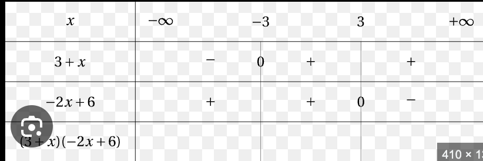

### Extremum
Pour optimiser des fonctions, on peut trouver des maximums et des minimums. Il y a présence de *points critiques* lorsque le dérivée d'une fonction donne 0. À ces points, il est possible d'y avoir des minimums ou des maximums. On utilise un tableau des signes pour les valider. 
On ajoute aux points critiques les intervales du problèmes, s'il n'y en a pas, on évalue la limite à $\infty$ et $-\infty$.
### Concavité
On peut trouver des points d'inflexion dans la fonction lorsque la dérivée seconde vaut 0. À ces points, il peut y avoir un changement de concavité. On doit évaluer le signe de la dérivée seconde avant et après le point d'inflexion pour le savoir.