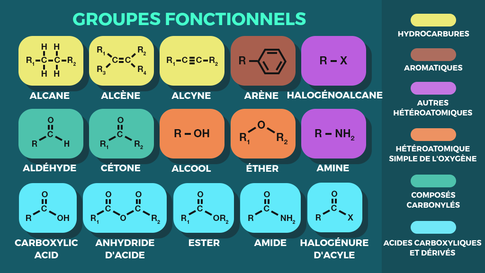

Le carbone est l'élément fondamentale de la vie

La [Chimie organique](Chimie%20organique) est l'étude des composés organiques. Elle a pour but de synthétiser et purifier les produits de la nature. Tous les composés du carbone peu importe leur origine sont considérés comme des composés organiques.

#### Hydrocarbure
Composé d'hydrogène et de carbone. C'est le principale composant du pétrole. La graisse en contient et il peut libérer une grande quantité d'énergie. Ils sont hydrophobes (peu polaire).

#### Molécule organique
Les molécules organiques ont souvent des [[isomères]], des molécules avec la même formule chimique mais une forme en 3D différente. ainsi, elles ont des fonctions différentes. 

Les molécules organiques sont souvent composées de groupement chimique important qui sont très communs. 

Une molécule organique très importantes est l'ATP: l'adénosine tri-phosphate qui permet de produire de l'énergie pour les organismes vivants
