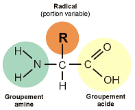

### Catégories de molécules complexes
Macromolécules: un polymère composé de plusieurs monomère:
- Glucide
- Protéine
- Acide nucléique

Lipides

### Synthèse et la dégradation des polymères
On utilise des enzymes:
- Amylase pour les glucides
- Lipase pour les lipides
- Protéase pour les protéins

#### Synthèse
Il faut faire de la déshydratation, on crée un lien covalent entre deux monomères et une molécule d'eau.

#### Dégradation
Il faut faire de l'hydrolyse, on utilise un molécule d'eau pour séparer le polymère et créer deux monomères.

### Glucide
#### Monosaccharide
Composé de 1 monomère, il s'agit de multiple de $CH_2O$. 

Les monosaccharides agissent comme source d'énergie pour les cellules. Il s'agit de matière première pour former des petites cellules et peut se stocker en di ou poly saccharides. Ils ont une forme cyclique en solution aqueuse. 

#### Polysaccharide
Des polymères de glucide. Il y en a plusieurs avec différents rôles

| Rôle     | Pour usage ultérieur                                                                                              | Stabilité et protection de l'organisme                                                                                                                      |
| -------- | ----------------------------------------------------------------------------------------------------------------- | ----------------------------------------------------------------------------------------------------------------------------------------------------------- |
| Végétaux | Amidon: polymère de glucose Amylose: non-ramifiée Amylopectine: ramifiée Liaison alpha (cis)             | Cellulose: polymère de glucose avec aucune ramification Liaisons hydrogènes entre les groupes hydroxyles confèrent sa résistance Liaison beta (trans) |
| Animaux  | Glycogène: polymère de glucose, plus ramifiée que l'amylopectine Cellule de foie et de muscle Liaison alpha | Chitine: polymère de glucose mais les monomères possèdent une chaine latérale avec de l'azote Liaison beta                                               |
### Lipides
Non composé de monomère, donc pas de polymère et pas de macromolécule. 

Composé majoritairement d'hydrocarbure

Molécule hydrophobe
#### Triglycérides
Emmagasine de l'énergie, 2 fois plus qu'un pylosaccharide

Il est composé de glycérol et d'acide gras: 

Acides gras saturés: pas de liaison double de carbone

Acides gras insaturés: liaisons double présentes

Mono-insaturés ou poly-saturés

##### Hydrogénation
Ajouter de l'hydrogène pour saturé un triglycéride avec de la chaleur
- Peut devenir un insaturé trans au lieu d'un saturé
- Augmente les chance de athérosclérose
L'humain est incapable de synthétiser des gras insaturés, les oméga-3 et 6 sont des gras insaturés essentiels

##### Rôle
Végétaux:
- Réserves énergétiques volumineuses
- Polysaccharides (amidon)
- Graines ont des réserves moins volumineuses de triglycérides insaturés
Animaux
- Doit avoir des réserves compactes de triglycérides saturés
- Le tissu adipeux sert de réserve de lipide et de protection
#### Phosphoglycérolipides (ou phospholipides)
Ressemble au triglycéride

Composé de glycérol et de deux acides gras plus un groupement de phosphate, ce groupement n'est pas hydrophobe mais plutôt hydrophiles

Dans l'eau, ils se rassemblent, ils forment une bicouche avec les têtes vers l'extérieur pour cacher les queues hydrophobes à l'intérieur. Il sont les principales composantes de la membrane cellulaire. Les queues sont face à face et les têtes hydrophiles pointent vers les milieux extra et intracellulaires.
#### Les stéroïdes
Faible affinité pour l'eau

Composés de quatre cycles d'hydrocarbures adjacents et de groupement fonctionnels (Chaine d'hydrocarbure)

Comprend le cholestérol et les hormones sexuels.

### Protéines
Composent plus de 50% de la masse sèche de la plupart des cellules

Interviennent dans presque toutes les activités cellulaires

Chaque type de protéines à une forme 3D différentes

#### Type de protéine:
##### Enzymatique
Accélère les réactions
##### De défense
Protège contre les bactéries et les virus
##### D'entreposage
Stoque les acides aminées
##### De transport
Transporte l'oxygène, peuvent être intégré dans les membranes
##### Hormonale
Régule et coordonne certaines activités cellulaires
##### Réceptrice
Sur la membrane, transmet l'information reçu dans la cellule, réagisse aux stimulis
##### Contractiles et motrices
Dans les muscles, permettent le mouvement
##### Structurale
Permettent de soutenir des choses dans le corps
#### Structure de la protéine
Composé de chaine d'acide aminés (environ 20 types différents).

Les acides aminés ont une structure régulière avec un radical variable qui défini la fonction de cette acides. Selon la chaines d'acide, on obtient des protéines différentes.

Un polypeptide est une structure répétitive d'acides aminés. 

Il existe trois niveaux de polypeptide:
##### Primaire
Chaine d'acides aminés liés entre eux selon une séquence unique
##### Secondaire
Forme répétitive sur un certain segment qui provient des liaisons hydrogènes qui se forme le long de la chaine: Hélice alpha ou Feuillet beta.
##### Tertiaire
Forme globale qui découle des chaines latérales, les radicaux hydrophobes s'isolent de l'Eau en allant vers le centre de la protéine.Il y a plusieurs type de liaison qui se créent alors:
- Hydrogène
- Force de Van der Waals
- Ionique
- Disulfurique

La structure d'une protéine est déterminée par la chaine polypeptidique. Le pH, les concentrations en sel et la température affecte la forme et la fonction d'une protéine.

### Acides nucléiques