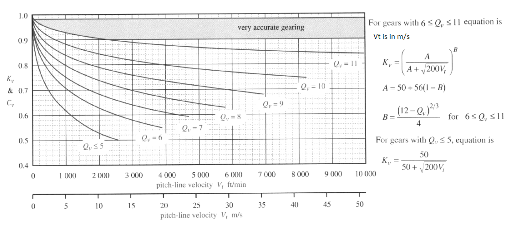
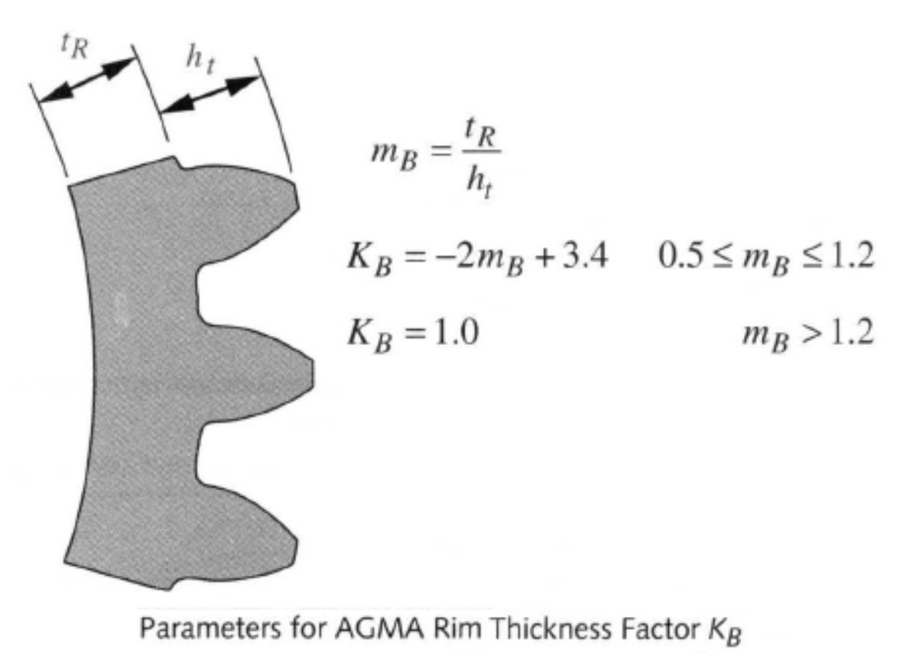

## Factors
source: https://theengineeringblog.com/gear-design-by-agma-theory/
### $K_v$ : Dynamic Factor
Dynamic factor $K_v$ accounts for the internally generated vibration loads (additional loads) from tooth to tooth impact due to non-conjugate meshing of gear teeth.

This factor depends on the Gear Quality Index ($Q_v$) and the Pitch line velocity.

If the actual dynamic loading to transmission error such as shaft misalignment, bearing misalignment, stiffness of the structure supporting the bearing can be taken into account by increasing the tangential load $W_t$ then $K_v$ can be set to 1.
#### Formulas:

### $Q_v$ : Gear quality index
AGMA quality number and represents the quality of gear in terms of the geometric accuracy of the teeth. Quality numbers from lowest quality Q3 to Highest quality Q16. It represent the accuracy of the tooth geometry; the higher the quality number the smaller the tolerance.
#### Parameters:
**The tooth lead or tooth alignment** criterion applies to spur and helical-type gearing and measures the variation between the specified lead (or helix angle) and the lead of the produced gear.    
  
**Involute profile variation** is the difference between the specified profile and the measured profile of the tooth.  

**Pitch variation or spacing variation** is the difference between the specified tooth location and the actual tooth location around the circumference of the gear.  

**Radial runout** refers to the disparity in radial position of teeth on a gear – the variation in tooth distances from the center of rotation.

#### Tolerances for each $Q_v$
source: https://www.americangearinc.com/quality/
source: https://www.engineersedge.com/gears/gear_toleances_fine_pitch.htm

| AGMA Quality No. | Number of Teeth and Pitch Diameter | Diametral Pitch Range | Tooth-to-Tooth Composite Tolerance | Total Composite Tolerance |
| ---------------- | ---------------------------------- | --------------------- | ---------------------------------- | ------------------------- |
| 5                | Up to 20 teeth inclusive           | 20 to 80              | 0.0037                             | 0.0052                    |
|                  | Over 20 teeth, up to 1.999"        | 20 to 32              | 0.0027                             | 0.0052                    |
|                  | Over 20 teeth, 2" to 3.999"        | 20 to 24              | 0.0027                             | 0.0061                    |
|                  | Over 20 teeth, 4" and over         | 20 to 24              | 0.0027                             | 0.0072                    |
| 6                | Up to 20 teeth inclusive           | 20 to 200             | 0.0027                             | 0.0037                    |
|                  | Over 20 teeth, up to 1.999"        | 20 to 48              | 0.0019                             | 0.0037                    |
|                  | Over 20 teeth, 2" to 3.999"        | 20 to 32              | 0.0019                             | 0.0044                    |
|                  | Over 20 teeth, 4" and over         | 20 to 24              | 0.0019                             | 0.0052                    |
| 7                | Up to 20 teeth inclusive           | 20 to 200             | 0.0019                             | 0.0027                    |
|                  | Over 20 teeth, up to 1.999"        | 20 to 200             | 0.0014                             | 0.0027                    |
|                  | Over 20 teeth, 2" to 3.999"        | 20 to 48              | 0.0014                             | 0.0032                    |
|                  | Over 20 teeth, 4" and over         | 20 to 40              | 0.0014                             | 0.0037                    |
| 8                | Up to 20 teeth inclusive           | 20 to 200             | 0.0014                             | 0.0019                    |
|                  | Over 20 teeth, up to 1.999"        | 20 to 200             | 0.0010                             | 0.0019                    |
|                  | Over 20 teeth, 2" to 3.999"        | 20 to 100             | 0.0010                             | 0.0023                    |
|                  | Over 20 teeth, 4" and over         | 20 to 64              | 0.0010                             | 0.0027                    |
| 9                | Up to 20 teeth inclusive           | 20 to 200             | 0.0010                             | 0.0014                    |
|                  | Over 20 teeth, up to 1.999"        | 20 to 200             | 0.0007                             | 0.0014                    |
|                  | Over 20 teeth, 2" to 3.999"        | 20 to 200             | 0.0007                             | 0.0016                    |
|                  | Over 20 teeth, 4" and over         | 20 to 120             | 0.0007                             | 0.0019                    |
| 10               | Up to 20 teeth inclusive           | 20 to 200             | 0.0007                             | 0.0010                    |
|                  | Over 20 teeth, up to 1.999"        | 20 to 200             | 0.0005                             | 0.0010                    |
|                  | Over 20 teeth, 2" to 3.999"        | 20 to 200             | 0.0005                             | 0.0012                    |
|                  | Over 20 teeth, 4" and over         | 20 to 200             | 0.0005                             | 0.0014                    |
| 11               | Up to 20 teeth inclusive           | 20 to 200             | 0.0005                             | 0.0007                    |
|                  | Over 20 teeth, up to 1.999"        | 20 to 200             | 0.0004                             | 0.0007                    |
|                  | Over 20 teeth, 2" to 3.999"        | 20 to 200             | 0.0004                             | 0.0009                    |
|                  | Over 20 teeth, 4" and over         | 20 to 200             | 0.0004                             | 0.0010                    |
| 12               | Up to 20 teeth inclusive           | 20 to 200             | 0.0004                             | 0.0005                    |
|                  | Over 20 teeth, up to 1.999"        | 20 to 200             | 0.0003                             | 0.0005                    |
|                  | Over 20 teeth, 2" to 3.999"        | 20 to 200             | 0.0003                             | 0.0006                    |
|                  | Over 20 teeth, 4" and over         | 20 to 200             | 0.0003                             | 0.0007                    |
| 13               | Up to 20 teeth inclusive           | 20 to 200             | 0.0003                             | 0.0004                    |
|                  | Over 20 teeth, up to 1.999"        | 20 to 200             | 0.0002                             | 0.0004                    |
|                  | Over 20 teeth, 2" to 3.999"        | 20 to 200             | 0.0002                             | 0.0004                    |
|                  | Over 20 teeth, 4" and over         | 20 to 200             | 0.0002                             | 0.0005                    |
| 14               | Up to 20 teeth inclusive           | 20 to 200             | 0.00019                            | 0.00027                   |
|                  | Over 20 teeth, up to 1.999"        | 20 to 200             | 0.00014                            | 0.00027                   |
|                  | Over 20 teeth, 2" to 3.999"        | 20 to 200             | 0.00014                            | 0.00032                   |
|                  | Over 20 teeth, 4" and over         | 20 to 200             | 0.00014                            | 0.00037                   |
| 15               | Up to 20 teeth inclusive           | 20 to 200             | 0.00014                            | 0.00019                   |
|                  | Over 20 teeth, up to 1.999"        | 20 to 200             | 0.00010                            | 0.00019                   |
|                  | Over 20 teeth, 2" to 3.999"        | 20 to 200             | 0.00010                            | 0.00023                   |
|                  | Over 20 teeth, 4" and over         | 20 to 200             | 0.00010                            | 0.00027                   |
Described composite tolerance can be visualised with this image:

### $K_m$ : Load distribution factor
Any Axial misalignment or axial deviation in the tooth form will cause the tangential load $W_t$ to be unevenly distributed to the face width. This problem is enhanced with bigger face-width gears.  So as a thumb rule face width to module ratio should be 8 to 16. (Face width/ Module = 8 to 16)
#### Rule of thumb values:

| Face Width (in) | Face Width (mm) | $K_m$ |
| --------------- | --------------- | ----- |
| $<2$            | 50              | 1.6   |
| 6               | 150             | 1.7   |
| 9               | 250             | 1.8   |
| $\geq 20$       | 500             | 2.0   |

### $K_a$ : Application Factor
This factor considers any kind of fluctuating load coming on the tooth. For example- if a gearbox is driving to a stone crusher then shock loads will come on the gear tooth due to crushing loads. For smooth applications where there is no fluctuating load, this factor can be taken as 1.
#### Rule of thumb values:

| Driving machine                          |         | Driven machine |             |
| ---------------------------------------- | ------- | -------------- | ----------- |
|                                          | Uniform | Moderate Shock | Heavy Shock |
| Uniform  (Electric Motor, Turbine)    | 1.00    | 1.25           | 1.75 +      |
| Light Shock (Multicylinder Engine)    | 1.25    | 1.50           | 2.00 +      |
| Medium Shock (Single-cylinder Engine) | 1.50    | 1.75           | 2.25 +      |

### $K_s$ : Size Factor
The size factor considers the fact that test samples used to establish the fatigue strength data by experiment to testing may be smaller in size than the actual part. $K_s$ allows the modification of tooth stress to account for such a situation. AGMA has not specified any value or formula for this. So, choosing this factor depends on the designer’s experience.  Generally, this factor is taken care by limiting the maximum allowed stress limit so $K_s$ can be taken as 1. For a conservative approach, $K_s$ 1.25 to 1.5 can be taken.

This factor can be used to compensate for other factor's estimations being too small or too large.

### $K_b$ : Rim Thinness Factor
This factor accounts for the situation of very large gears that are made on rims and spokes rather than on solid disk and have think rim compared to tooth depth. AGMA defines backup ratio $m_B$ as follows. Backup ration less than 0.5 is not recommended, gears on a solid disk will have $K_b=1$.

### $K_i$ : Idler Factor
In a gear train, the idler is subjected to more cycles of stress per unit time than the other gears. To account for this $K_i$ is set to 1.45 for idler and 1 for non-idler. This factor can be added along with the other stress increasing factors ($K_a$, $K_s$ & $K_m$).
For more information about idler gears, see: https://punchlistzero.com/idler-gear/