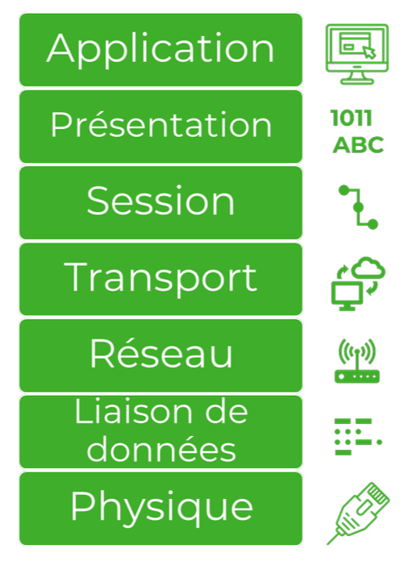

Pour assurer une bonne communication entre plusieurs appareils sur le réseau, il faut respecter un certain **protocole de communication**. Ces protocoles suivent souvent le même modèle baptisé **OSI** qui se divise en une série de couche pour gérer différente partie de la communication. On appelle ces couches des **pile de protocoles**: 
### Plie de protocole
Chaque couche du modèle utilise un protocole spécifique. Le paquet du message d'une couche supérieur devient le message d'un couche inférieur lors de l'envoie et vice-versa lors de la réception.

#### Couche physique et liaison de données
Le protocole IEEE 802.3 (Ethernet) et IEEE 802.11 (LAN sans-fil) se situent au niveau de la couche physique et de la couche de liaison de données. La couche physique précise le mode de transmission de données par câble ou par signal sans-fil. La couche de liaison de données décompose le paquet en une séquence de **trames** plus petites et s'assure de les transmettre dans le bon ordre. La décomposition du message en trames assure une meilleure qualité de transmission, s'il y a un erreur, seul la trame erronée doit être renvoyer au lieu du message en entier.
#### Couche réseau
La couche réseau détermine comment les paquets seront acheminées vers leur destination. La route passera par des routeurs avant d'atteindre de l'équipement récepteur de paquets. Tout cela est régis par le protocole Internet (IP). 
#### Couche transport
Les protocoles TCP et UDP sont deux options de transports. TCP comprend un mécanisme de validation de réception, ça ralenti la vitesse mais augmente la fiabilité. UDP n'en a pas mais est plus rapide en contre partie.
#### Couche de session et présentation
Elle établie un session de communication entre des appareils et interprète les bits d'information sous la forme de valeur avant de les envoyé à la couche application.
#### Couche application
Elle précise le format et la structure des données afin que le message serve les besoins de l'application.

### Gestion des erreurs de transmission
Il existe plusieurs techniques permettant de gérer les erreurs lors de la transmission d'un message.
#### Parité
La technique la plus simple est l'utilisation d'un **bit de parité**. On ajoute un bit à la transmission qui va servir à déterminer la parité du message selon une norme pré-établie. Si le message reçu n'a pas la même parité que le message envoyé, on sait qu'il y a une erreur. Bien sure la technique n'est pas infaillible et d'autre technique plus avancée existe.