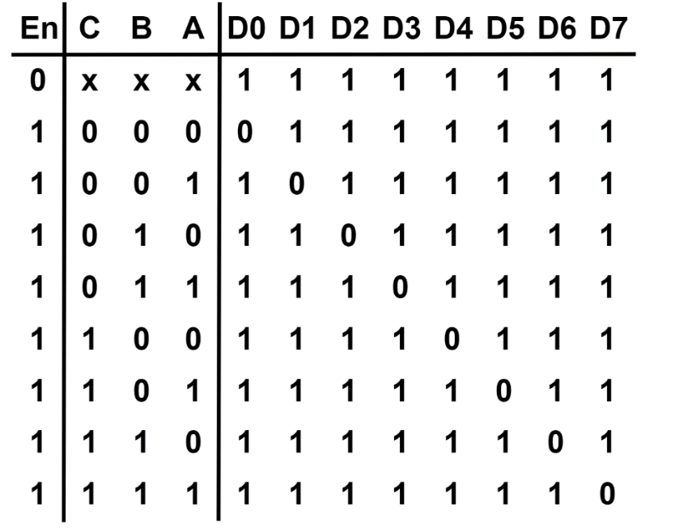
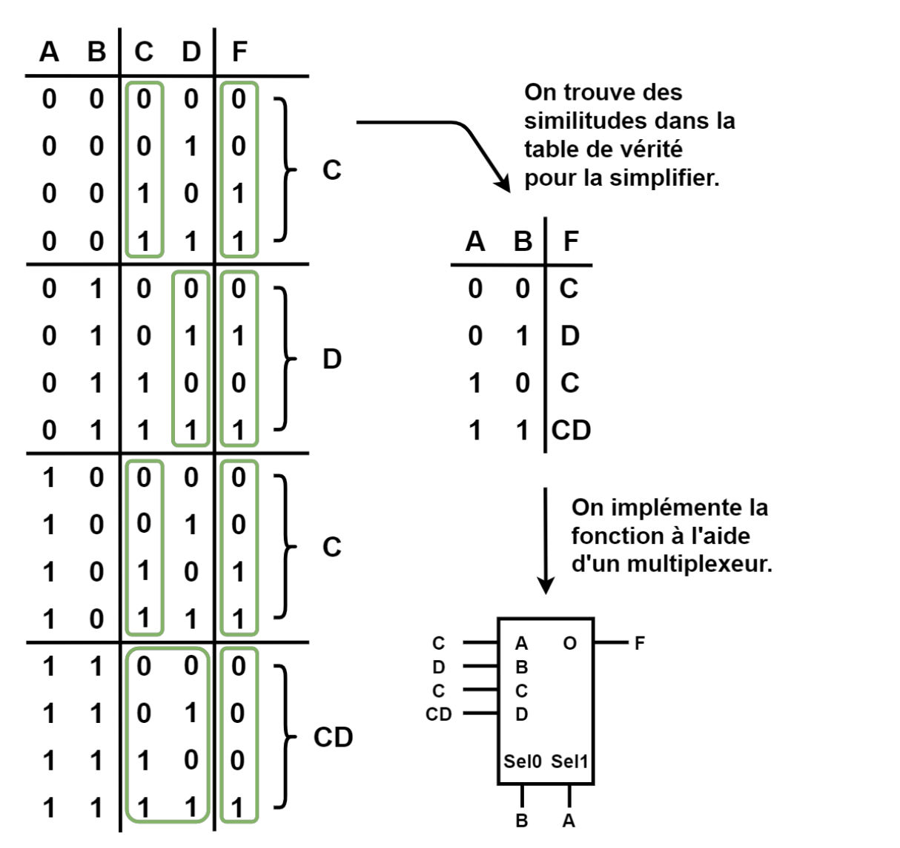
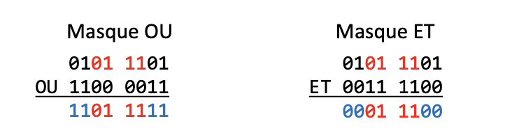

### Encodeur et décodeur
Par convention, un encodeur convertit un nombre sous une forme nécessitant autant ou moins de bits et un décodeur convertit un nombre sous une forme nécessitant autant ou plus de bits.

Les circuits logiques sont souvent vendus sous la forme de **circuits intégrés** pour permettre une conception plus compacte sur un circuit imprimé.
Exemple du décodeur 3 à 8, il prend un signal binaire 3 bits et retourne un signal binaire 8 bits pour contrôler des sorties digitales: 

### Multiplexeur
Un multiplexeur sélectionne un entrée parmi plusieurs et la transmet à la sortie unique selon un combinaison binaire sur les pins de contrôle: 
### Masque binaire
Un masque binaire permet d'isoler un sous ensemble de bits d'un nombre ou d'une trame. On peut appliquer un masque OU pour forcer certaine bits à 1 et un masque ET pour forcer certaine bits à 0: 
### Parité
Cette fonction évalue s'il y a un nombre impair de bits dont la valeur est 1 dans un nombre sur plusieurs bits. Elle est composée de plusieurs porte OU exclusive *XOR* en cascade.