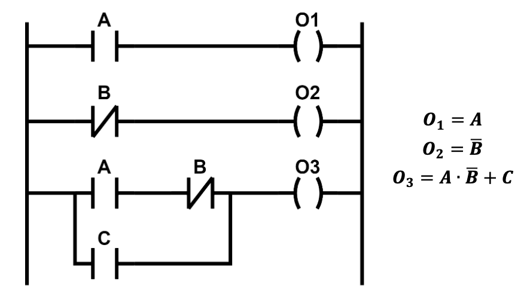
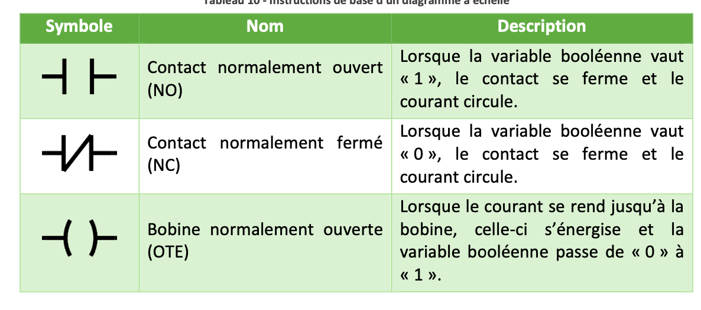

### Implémentation sur un automate programmable
Sur un automate, on implémente des fonctions logiques à l'aide d'un **diagramme à échelle**, *ladder* en anglais. Il se lit de gauche à droite et de bas en haut. Il se lit comme un circuit électronique, la ligne verticale gauche est la tension d'alimentation et la ligne verticale droite est la tension de référence. 
#### Instructions de base
On peut utiliser trois instructions de base pour faire un diagramme à échelle

Les instructions plus complexes dépendent du langages de programmation, pour les automates Rockwell, il est intéressant d'aller lire les instructions **BTD, COP, JSR, MOV**, aux **opérations mathématiques** et aux **instructions de comparaison** dans leur [documentation](https://literature.rockwellautomation.com/idc/groups/literature/documents/rm/1756-rm003_-en-p.pdf). 

Dans notre cas, il est préférable de moins utilisé l'instruction *JSR* ou *Jump to Sub-Routine* puisqu'elle rend notre logique plus complexe et plus difficile à corriger.
#### Temps de cycles d'un automates
Un automate exécute son programme en boucle en suivant une séquence:
- La lecture des signaux d'entrée
- L'exécution du programme
- La mise à jour des signaux de sortie

Il y a donc un délai entre la mesure des entrées et la mise à jour des sorties. Si un évènement arrive lors de ce délai, l'automate ne pourra pas réagir.
### Implémentation sur un circuit électronique numérique
On peut aussi implémenter des fonctions logiques sur des circuits électroniques à l'aide de **porte logique**. En connectant ces portes logiques en cascade, on peut obtenir des programme plus complexe. Il existe quatre portes logiques de base, le tampon, l'inverseur, le ET et le OU. Chaque porte comporte des caractéristiques électriques.
#### Le délai de propagation
Il représente la durée entre la mise à jour d'une entrée et la mise à jour de la sortie de la porte
#### Le fan-in
Il représente le nombre de signaux d'entrée qu'une porte peut accepter
#### Le fan-out
Il représente le nombre maximal de porte pouvant être reliées à la sortie d'une même porte logique du niveau précédent. Il représente le plus petit entre $\frac{I_{OH}}{I_{IH}}$ et $\frac{I_{OL}}{I_{IL}}$.
#### Les niveaux de tension
##### $V_{IL}$
La tension d'entrée basse
##### $V_{IH}$
La tension d'entrée haute
##### $V_{OL}$
La tension de sortie basse
##### $V_{OH}$
La tension de sortie haute

Pour assurer une bonne communication entre les portes logiques, il faut que: $$V_{OL} \leq V_{IL}$$
et $$V_{OH} \geq V_{IH}$$
Plus les plages de tension sont basse, plus il y aura du bruit dans le signal, c'est pourquoi les industrie opèrent souvent avec un niveau logique de 24V.