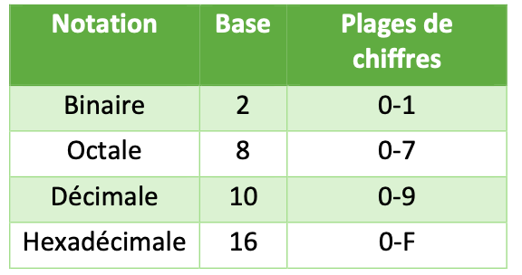
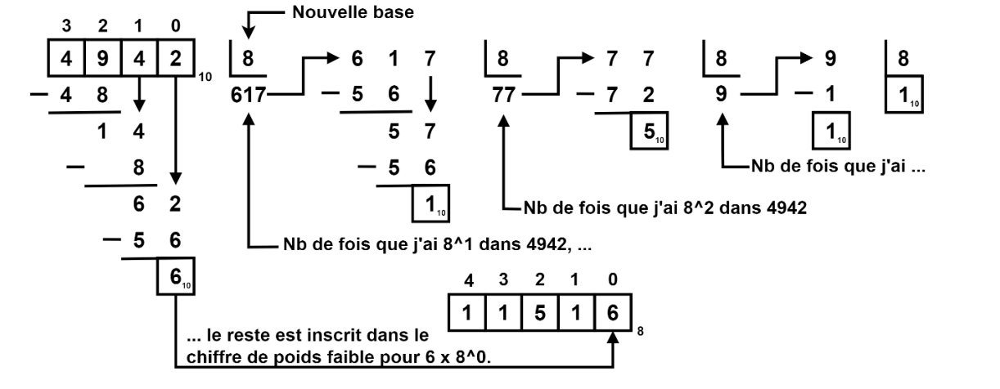
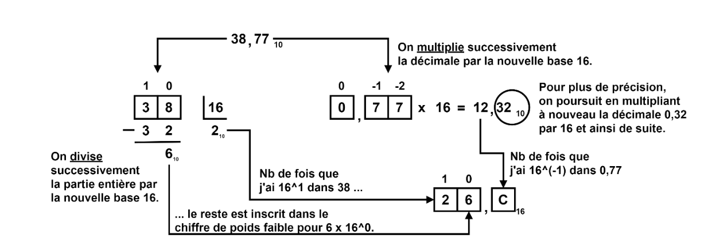
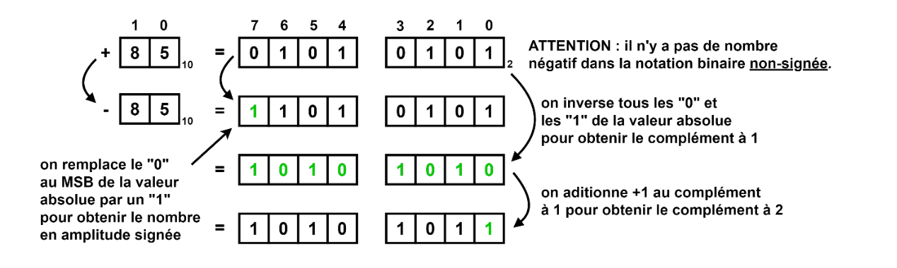
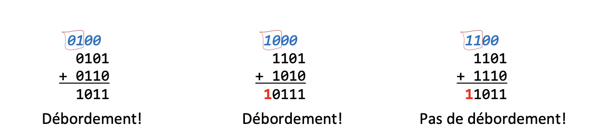
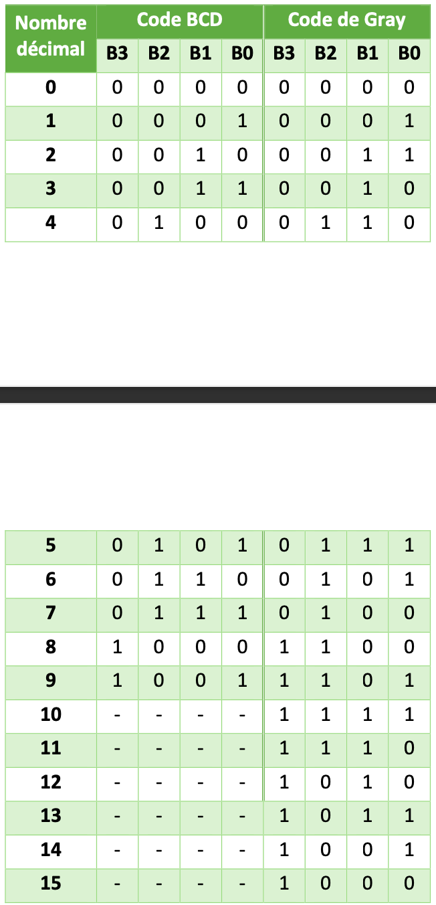
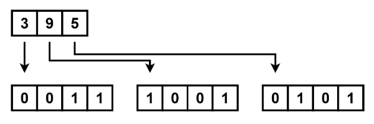

### Notation binaire, octale, décimale et hexadécimale
Ces notations fonctionnent toutes de la même manière, elles sont seulement une base différente: 

Chaque bit possède un poids en fonction de sa position. Elles sont ce qu'on appelle en anglais une *least significant bit (LSB)* et une *most significant bit (MSB)* soit les chiffres de la position le plus à droite et le plus à gauche respectivement.

#### Méthode de conversion entre les bases
Voici un méthode de base pour passer d'une base décimale à une autre base: 
et dans le cas des nombres non-entier: 
*D'autres méthodes seront vus plus tard.*

Il est utile de se rappeler des lois des exposants lors de la conversion de nombre en d'autres bases. 
### Notations signées et non signées
Quand on écrit un nombre négatif de manière manuscrite, on rajoute un symbole «-» devant le nombre. Cependant, un ordinateur n'enregistre pas de symbole seulement des bits. 

#### Amplitudes signées
Les nombres représentés en **amplitudes signées** utilise un bit de moins que leur grandeur puisqu'il stock leur signe dans le **MSB**. ) pour positif et 1 pour négatif. Cependant, faire des calculs avec des nombres en amplitude signée n'est pas simple pour un ordinateur. C'est pourquoi d'autre notation sont utilisé.

#### Complément 1
Pour obtenir la notation complément 1, on inverse toutes les bits de la valeur non signée du chiffre. Le désavantage est qu'on obtient deux manières d'écrire le nombre 0 et on réduit inutilement la plage de donnée de valeur possible.
#### Complément 2
Pour régler ce problème, la notation en complément 2 ajoute 1 à tous les nombres négatifs permettant de regagner le bit perdu.

Voici un exemple de conversion de nombre négatif dans les différentes notations, les nombres positif demeure les même: 
Les plages de valeurs de chaque notation varie légèrement, elles sont les suivantes pour un octet: 
### Concept de débordement
Dans un nombre à 4 bits en complément à 2, il est impossible de représenté +8. Si on ajoute 1 à 0111 (7), on obtient 1000, qui représente -8. Il y a donc un **débordement** dans la valeur binaire.

Il existe une méthode simple pour détecter les débordements: une addition ne déborde jamais si les deux *opérandes* sont de signe différent. Si après après une addition de deux opérandes de signes identiques le **MSB** du résultat est différent du **MSB** des opérandes, il y a débordement.

Un autre manière de voir s'il y a débordement est de regarder si les retenues avant et après le **MSB** sont différentes, il y aura alors un débordement: 
### Code BCD et code Gray
Il s'agit de deux manière de présenter des chiffres en binaire.

Le code BCD représente les chiffres de 0-9 de la même manière que la notation binaire. Pour les nombres plus élevé, on ajoute 4 bits pour chaque chiffre supplémentaire: 

Le code Gray utilise un approche complètement différente, il est utilisé dans plusieurs applications dont les **tables de Karnaugh**.

Le code ASCII quant à lui sert à encoder sur 8 bits l'information sous forme de texte dans un système numérique.

Un **encodeur** est une fonction permettant le passage d'une notation à un autre, un **décodeur** fait l'inverse.