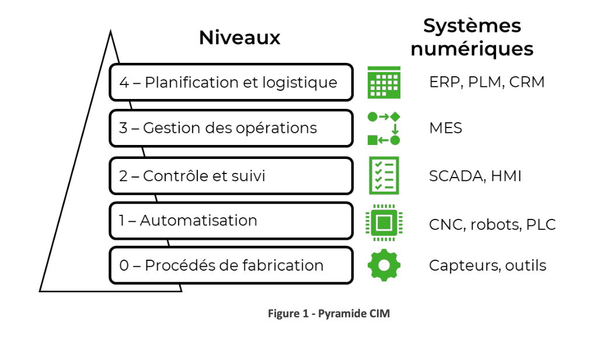

### Processus et procédés
**Processus**: Désigne une suite d'opérations visant à atteindre un but

**Procédés**: Désigne une méthode utilisée pour obtenir un résultat

Le processus de fabrication d'un produit est composé de plusieurs étapes tel que des procédés d'usinage, d'assemblage et de contrôle de qualité.

**Les procédés continus** concernent la production ininterrompue d'énergie ou de produit chimique. On mesure ici le volume et non pas le nombre d'unités.

**Les procédés discontinus** concernent la fabrication de produits manufacturés.

### Hiérarchie des technologies numériques
Il existe plusieurs types de technologie numérique pouvant être regroupées et hiérarchisées dans une industrie. 

Au plus haut niveau, on a **le système de gestion intégrée (ERP)** qui gère la comptabilité, les commandes etc. Ensuite, on a **le système d'exécution manufacturière (MES)** qui fait le pont entre les processus administratifs et la production. Il gère la priorité des tâches et indique le rendement global de la production. **Le système de contrôle et d'acquisition de données (SCADA)** suit l'état de chaque cellule et contrôle ses paramètres importants. Il comporte souvent une interface visuelle (HMI). Enfin, **les automates programmables (PLC), les machines 
 commande numériques (CNC) et les robots** automatisent les tâches réalisé par des outils, bras etc en se basant sur des capteurs.