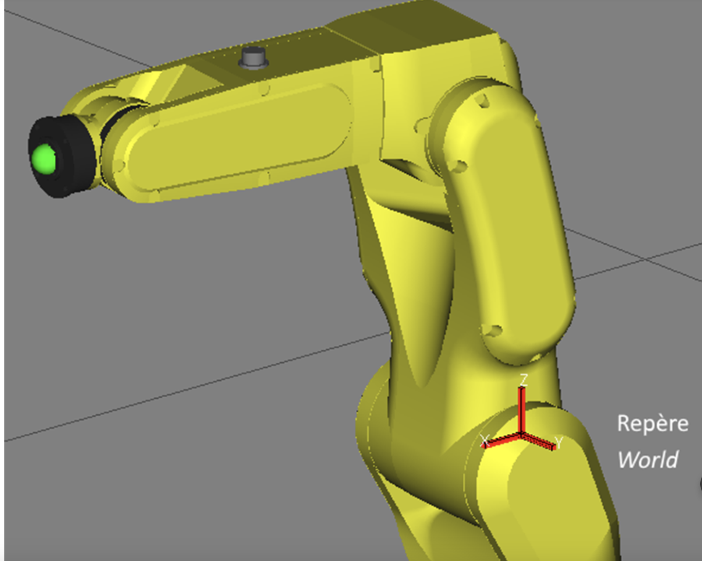
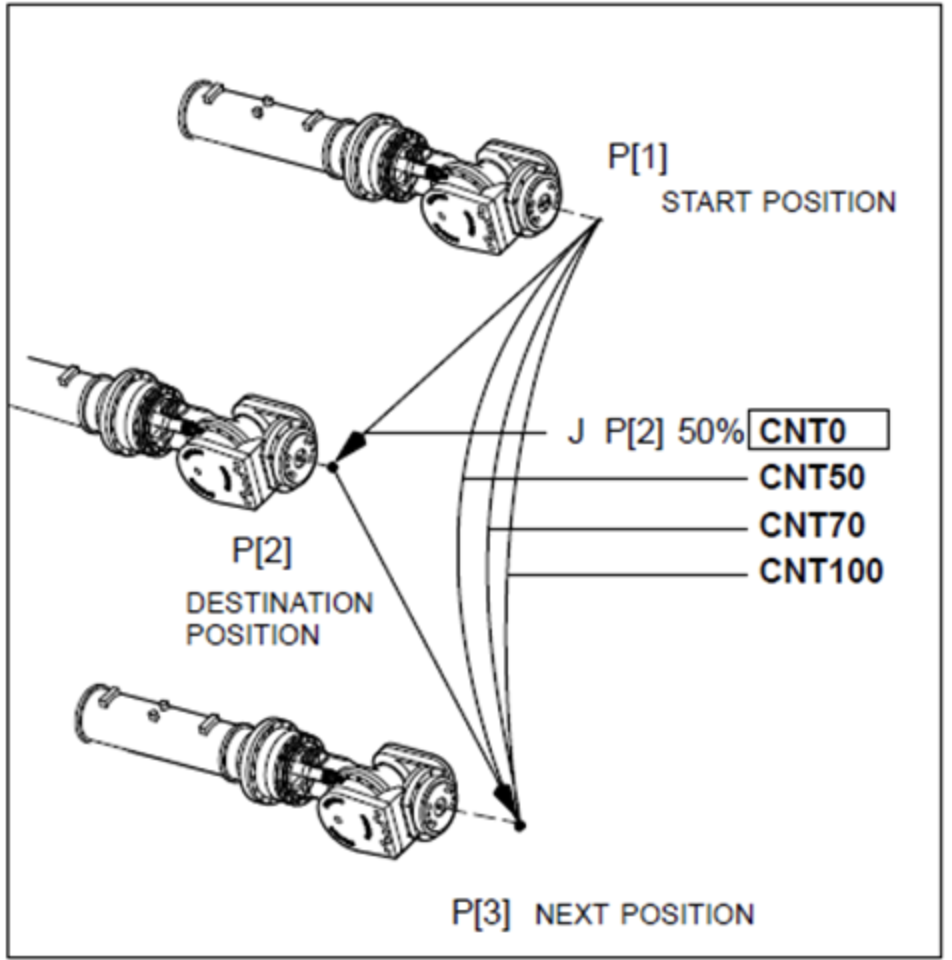
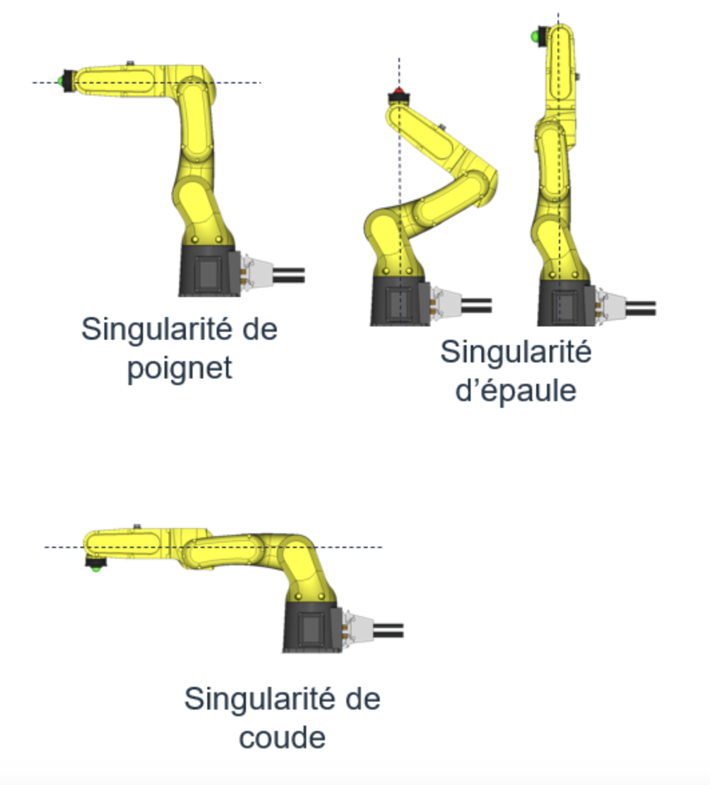

### Introduction
#### LR Mate0 200iD
Il s'agit d'un bras à 6 joints ressemblant au bras humain. Il possède 6 degrés de liberté, translation en x, y, z et rotation autour de x(Yaw), y(Pitch), z(Roll). On peut combiner ses rotations pour obtenir un rotation finale totale. 
#### Simulation
La simulation permet de créer des programmes hors-lignes et de définir des repères qui seront utilisés par les programmes. Pour faire une bonne simulation, il faut que l'environnement soit réaliste. Ça permet de valider que:
- le robot ne génèrent pas de contact avec d'autres éléments
- le robot reste à l'intérieur de l'environnement de travail *(ensemble des positions physiques où le robot peut se rendre)*
- le robot ne génèrent pas de changement de configuration trop rapide entre deux positions.

#### Bon à savoir
On parle parfois d'*enseigner* un parcours au robot avec une liste de points. On peut faire bouger le robot de façon manuelle en utilisant la manette *(teach pendant)* pour l'amener à des points précis *(jog the robot)*.

### Repère
Un repère sert à définir la position de quelque chose. On repert est constitué de deux choses:
- Un origine, on définit les vecteurs positions par rapport à ce points
- Une base vectorielle, un ensemble de vecteurs qui définissent l'espace, on définit les axes de rotation W, P, R autour des vecteurs de cette base

Un repère contient donc 6 informations: x, y, z, w, p, r.

Dans un Fanuc, il y a trois repère principal:
- Le **World**
- Le **User frame**
- Le **Tool frame**.
#### Repère World
Le repère world (0,0,0,0,0,0) est situé sur le 2e joint du robot, à 330mm de la base. Il est aussi appelé *Uframe0*. Il s'agit du repère principal, les objets et les autres repères sont définis par rapport à lui.

#### Repère User
Il s’agit du repère par rapport auquel on décrit les positions du robot. **Les coordonnées du _User Frame_ sont elles-mêmes définies par rapport au _World_.** Ainsi, un _User Frame_ qui n’est pas initialisé est donc à (0,0,0,0,0,0), c’est-à-dire qu’il coïncide avec le _World_.

Or, il est pratique de définir des _User Frames_ à divers endroits dans la celluleAinsi, si la configuration de la cellule venait à changer, il suffira de modifier la valeur du _User Frame_ représentant le point focal, et les positions qui auront été enseignées par rapport au _User Frame_ seront encore valides tandis que celle par rapport au *World frame* devront tous être refaite.

On constate que la définition du coin de la table est beaucoup plus simple et intuitive lorsqu’elle est exprimée en fonction du repère de la table. Sans mentionner que le repère « T1 » suivra automatiquement la table si on la déplace.

D’autre part, les _User Frames_ permettent de créer des programmes beaucoup plus faciles à comprendre. Il faut donc s’assurer d’enseigner les positions en fonction d’un _User Frame_ qui permet de simplifier la compréhension. Par exemple, une trajectoire fait sur un équipement ou une pièce devrait être défini par rapport au repère de l’équipement ou de la pièce.

#### Repère Tool
Le _Tool Frame_ est le repère outil qui est défini par rapport au bout du robot (sur le joint 6). Il est constitué du Tool Center Point et de la base vectorielle (3 vecteurs) qui définit l’orientation du repère.  Typiquement, le _Tool Frame_ est défini au bout de l’outil.

Enfin, il est important de noter que bien que ce repère porte le nom de ‘repère outil’, il n’indique pas toujours la position de l’outil. En effet, plutôt que de tenir un outil, le robot pourrait tenir un préhenseur qui ira prendre des pièces: dans ce cas-ci, le _Tool Frame_ serait probablement défini au bout du préhenseur, en son point central, soit à l’endroit où il ira prendre les pièces. On l’appellerait quand même _Tool Frame_, ce qui peut porter à confusion.

#### Système d'axe des repères
Les repères suivent un système d'axe [direct](../../../Collégial/3e%20session/Algèbre%20linéaire/Vecteur%20de%20R3%20et%20Rn.md), c'est à dire qu'il respecte la règle de la main droite pour les rotations et les translations 

#### Convention de rotation
Lorsque plusieurs rotations sont exécutées, il est important de tenir compte de l'ordre dans lequel ces rotations sont exécutés. Il existe plusieurs manière de les décrire et plusieurs conventions mais les robot Fanuc utilise la convention **Euler mobile Z'Y'X'**. Ça signifie que vous commencez par appliquer la rotation autour de Z. Vous prenez ensuite ce nouveau repère temporaire (d’où la notation Z’) et y appliquez la rotation en Y, ce qui vous donnera un 2e repère temporaire. Finalement, vous effectuez la rotation autour de X à partir de ce 2e repère temporaire, ce qui vous donne la position finale.

### Type de mouvement
Il existe 3 types de mouvements robot : 

1. **Mouvement en Joints**
	1. Le robot fait bouger tous ses axes en même temps. Le plus rapide pour passer d'un point à un autre
2. **Mouvement Linéaire**
	1. Si on veut que le robot se rendre à une autre position avec une vitesse fixe et en ligne droite.
3. **Mouvement Circulaire**
	1. On peut aussi faire la même chose mais avec des cercles.

#### Terminaisons mouvement
##### CNT
La terminaison **CNT** *(continuous motion)* permet de ralentir le robot en arriver au point pour aller au prochain point. Une valeur de 0 à 100 définie la distance à laquelle le robot passe à la position de destination. On utilise CNT pour les mouvements les plus efficaces autour des objets.

##### Fine
La terminaison FINE positionne le robot au point précis. Utile pour les parcours de soudure ou d’assemblage

#### En résumé:  
- un mouvement linéaire (L) donnera une trajectoire en ligne droite du TCP entre 2 points. Le mouvement angulaire de chacun des moteurs sera donc calculé en ce sens. 
    
- un mouvement joint (J) donnera une trajectoire quelconque du TCP entre 2 points, celle-ci étant tributaire du mouvement angulaire de chacun des moteurs. Ce mouvement est fait de façon à ce qu’il débute et termine en même temps pour chaque moteur. 
    
- une coordonnée exprimée en position cartésienne désigne une pose dans l’espace, elle est donc exprimé en 6 valeurs, 3 pour la position et 3 pour l’orientation. Cette pose en exprimée en fonction d’un repère. 
    
- une coordonnée exprimée en joints désigne la position angulaire de chacun des moteurs. Dans le cas d’un robot à 6 joints, elle est exprimée par 6 valeurs, une pour chaque joint. Il en résulte une certaine position de l’extrémité du robot.
### Singularités et limites de joints

Il peut arriver que votre robot soit pris en ‘singularité’.  Il s’agit en fait d’une position pour laquelle le robot a une multitude de solutions.  Pour l’instant, retenez simplement que si votre robot refuse de bouger et indique qu’il est en singularité, vous devrez revenir en mouvement en joint, bouger un peu le robot, puis réessayer le mouvement désiré en retournant en jog selon un repère.  

### Configuration
- Un robot peut avoir plusieurs postures différentes afin d’arriver à un même point dans l’espace. Cette posture est appelée « configuration » dans le monde de la robotique. La configuration du robot représente la valeur de ses paramètres afin de définir quelle posture a été choisie pour atteindre un point désiré.
- Un robot 6 axes peut amener un outil en huit configurations différentes.