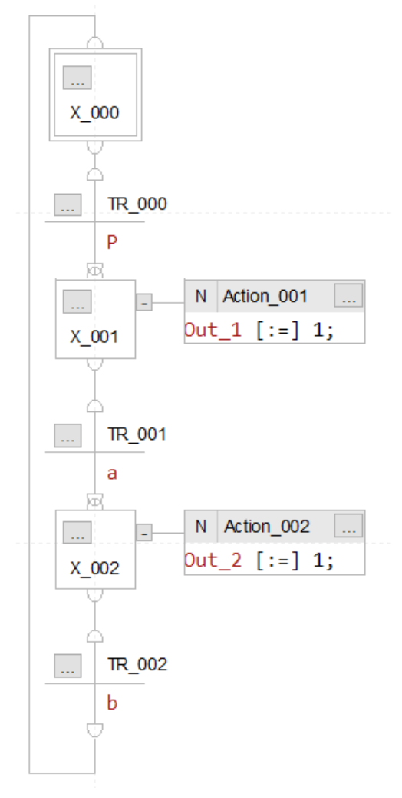
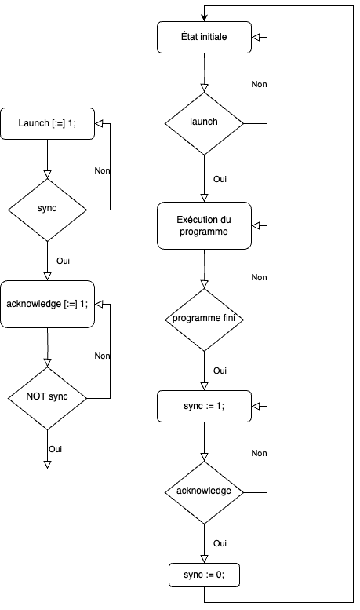

L'exécution d'un programme grafcet se fait en trois étapes: la lecture des nouvelles valeurs en entrée, l’exécution du programme et la mise à jour des sorties.

Un grafcet est une programmation d'une [machine à état](../Projet/Machine%20à%20état.md). Il respecte donc le [principe d'automaintien](../Projet/Machine%20à%20état.md#Principe%20d'auto-maintien). Il est possible de faire du grafcet en diagramme à échelle mais il est beaucoup plus simple d'utilisé un langage plus graphique tel que le **SFC**. 
Dans du **SFC**, on peut inclure des la logiques non-booléenne. Il s'agit de texte structuré. Il est **important** de noté la différence entre les deux symboles d'assignation de variable en texte structuré. Le symbole **:=** est une assignation normale d'une variable tandis que le symbole **[:=]** est une assignation temporaire. La variable va revenir à son état initiale lorsque l'état va être fini.
#### Parallélisme
Même si mathématiquement un machine à état ne peut pas avoir plusieurs états de sortie, il est possible de faire du parallélisme en **SFC**.

#### Hiérarchie de grafcet
On ne réalise pas tout dans le même grafcet. Il est d'usage de séparé les taches dans différents programmes. Cependant, il y a un ordre de priorité selon ene des approches répandues pour l’organisation d’un programme séquentiel sur un automate, *le guide d’étude des modes de marche et d’arrêt (GEMMA)*:
1. Grafcet de sécurité
2. Grafcet de conduite
3. Grafcet de production normale
4. Grafcet des mécanismes

Le **grafcet de sécurité** est le plus haut dans la hiérarchie. Dès qu’un arrêt d’urgence est déclenché, et ce peu importe à quel état dans l’exécution du programme, le grafcet de sécurité s’assure de gérer la remise à l’état initial des grafcets inférieurs avant d’autoriser une remise en marche du système si les conditions nécessaires sont présentes.

Le **grafcet de conduite** gère l’initialisation du système et les différents modes et réglages de production. La séquence complète de production est quant à elle implémentée dans le **grafcet de production normale**. Pour ne pas être trop lourd et pour faciliter la modularité du programme, les mécanismes unitaires sont implémentés dans des grafcets séparés et synchronisés avec les états de la production normale le moment venu. Le grafcet de production normale se synchronise à un certain moment avec le grafcet de conduite et celui-ci avec le grafcet de sécurité.

#### Synchronisation entre des grafcets
