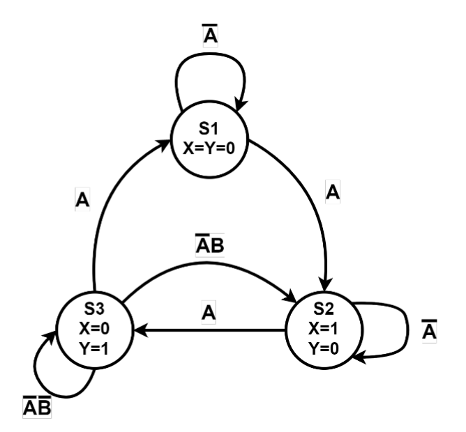
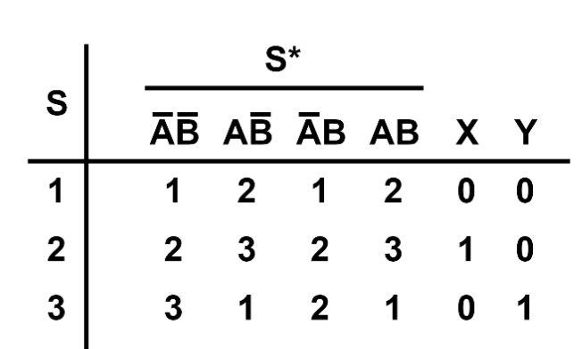
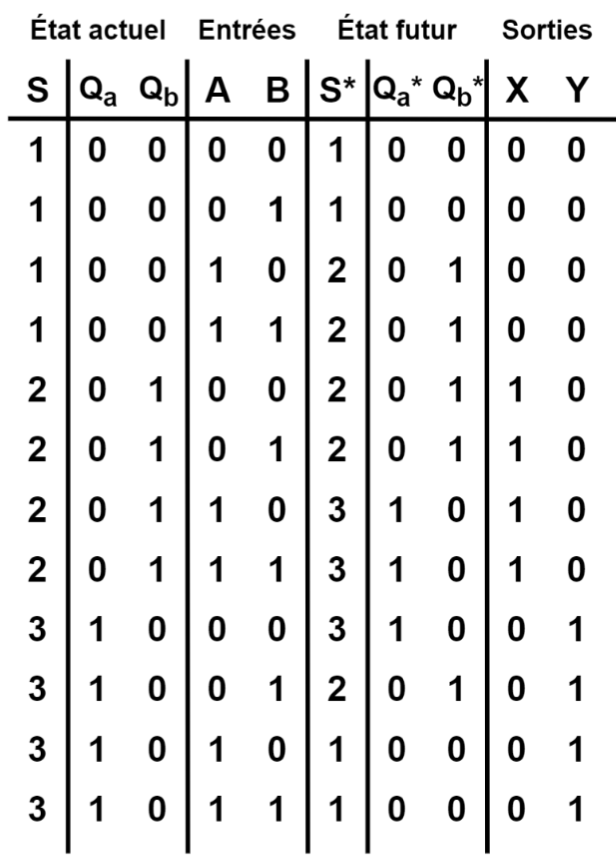
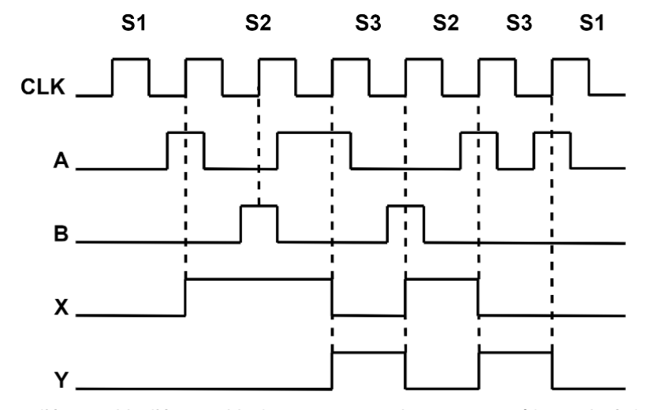

### Démarche de conception d'un système séquentiel
#### Analyse des spécifications fonctionnelles
Il faut réussir à traduire la demande du client sous forme de variable booléenne. Il faut aussi trouver les différents états du système ainsi que leur transition.

Il existe plusieurs manières de représenter l'information:
##### Diagrammes d'états
Un méthode très visuelle. Par convention, il n’y a pas de variables autre que les états eux-mêmes, les entrées et les sorties, dans votre diagramme d’état.

##### Tables d'états
Une représentation très condensée et très simple à consulter. La variable S y représente l’état actuel et S* représente l’état futur une fois la transition effectuée

##### Tables de transitions
Une méthode qui permet de bien visualiser les changements d'états. Elle ressemble à une table de vérité et permet de trouver les *équations d'excitations* et les *équations de sortie* du système. Les variables 𝑄𝑎 et 𝑄𝑏 servent à encoder l’état actuel. Comme il n’y a que 3 états S1 à S3 dans le scénario, deux bits suffisent pour tous les représenter. Les équations d’excitations sont les équations. De la même façon, les variables 𝑄𝑎∗ et 𝑄𝑏∗ servent à encoder l’état futur. Une équation d’excitation est l’expression d’une variable 𝑄∗ en fonction des variables d’entrée (ici A et B) et de l’état actuel (ici 𝑄𝑎 et 𝑄𝑏). Une équation de sortie est l’expression d’une sortie numérique en fonction des mêmes variables (A, B. 𝑄𝑎 et 𝑄𝑏).

##### Chronogrammes
Il permet de mieux décrire le comportement transitoire du système

#### Conception de la machine à état
Il faut dériver les équations d'excitations et de sortie du système avec notre représentation de l'étape précédente.
#### Implémentation du système
On programme en [grafcet](Base%20du%20grafcet.md) notre système séquentiel.
#### Validation du système
Un plan de validation permet de s'assurer du bon fonctionnement du système.