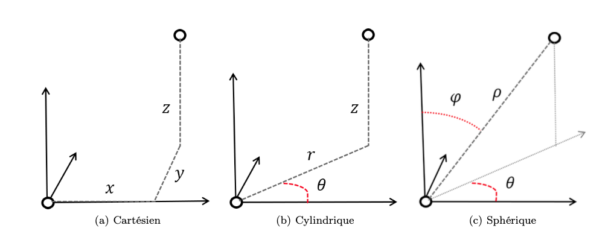
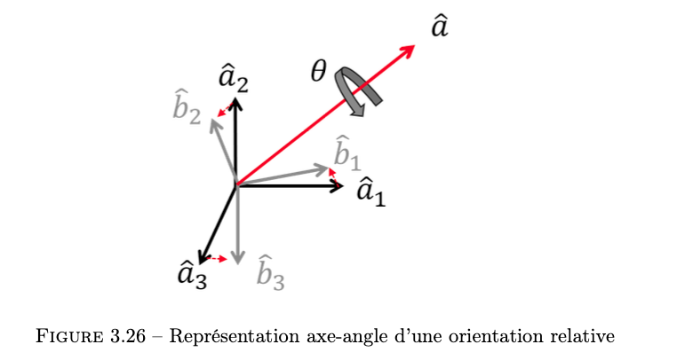
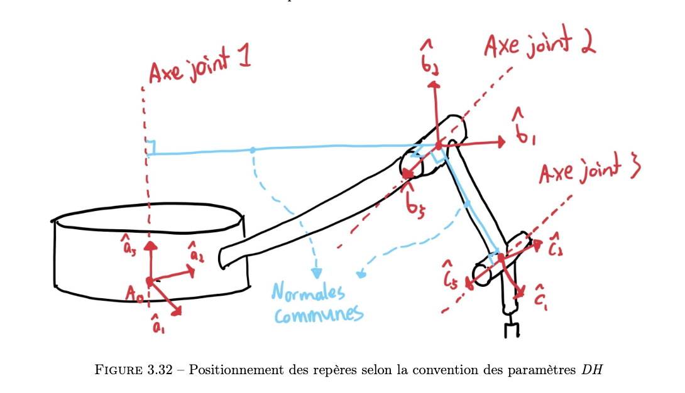
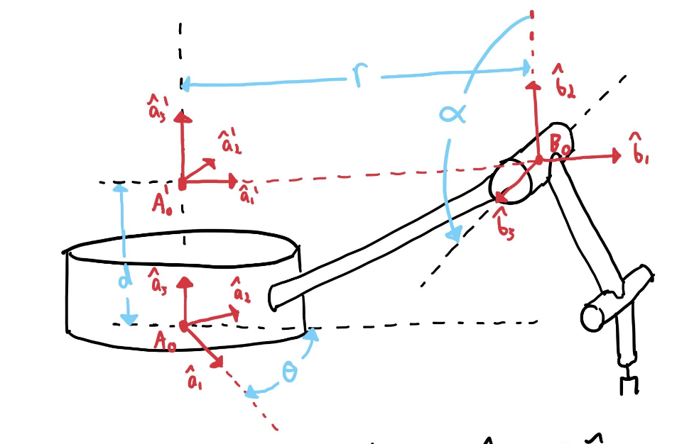

Elle consiste à calculer les fonctions de transformations pour passer d'un système de coordonnées à un autre.

### 3.1 Systèmes de coordonnées
Un système de coordonnées est un ensemble de scalaires, généralement des distances et des angles qui décrivent la position d'un système.
#### 3.1.1 Position d'une particule
Dans un espace 3D, un particule à 3 DDL. On peut utiliser trois types de systèmes pour la décrire:
1. Cartésien
2. Cylindrique
3. Sphérique

Selon la situation, un système peut être plus adapté qu'un autre. Voici une charte de conversion d'un système à l'autre:

|                  | De cartésien                                                                                           | De cylindrique                                                         | De sphérique                                                                           |
| ---------------- | ------------------------------------------------------------------------------------------------------ | ---------------------------------------------------------------------- | -------------------------------------------------------------------------------------- |
| Vers cartésien   | $x=x$ $y=y$ $z=z$                                                                                | $x=r\cos{\theta}$ $y=r\sin{\theta}$ $z=z$                        | $x=\rho\sin{\phi}\cos{\theta}$ $y=\rho\sin{\phi}\sin{\theta}$ $z=\rho\cos{\phi}$ |
| Vers cylindrique | $r=\sqrt{x^2+y^2}$ $\theta=\arctan{\frac{y}{x}}$ $z=z$                                           | $r=r$ $\theta=\theta$ $z=z$                                      | $r=\rho\sin{\phi}$ $\theta=\theta$ $z=\rho\cos{\phi}$                            |
| Vers sphérique   | $\rho=\sqrt{x^2+y^2+z^2}$ $\theta=\arctan{\frac{y}{x}}$ $\phi=\arctan{\frac{\sqrt{x^2+y^2}}{z}}$ | $\rho=\sqrt{r^2+z^2}$ $\theta=\theta$ $\phi\arctan{\frac{r}{z}}$ | $\rho=\rho$ $\theta=\theta$ $\phi=\phi$                                          |

#### 3.1.2 Pose d'un corps rigide
Dans un système 3D, la position d'un corps rigide à 3 DDL et sa rotation aussi. Ainsi, On peut représenté sa position et son orientation avec des systèmes à 6 DDL. On appelle cette information la **pose** d'un corps rigide. Il existe plusieurs manières de représenter l'orientation d'un corps rigide et il s'agit d'un problème complexe. On peut utiliser des matrices de rotations, des angles d'Euler ou des quaternions. Ces méthodes seront discuté à la section [3.7](#3.7).
#### 3.1.3 Configuration d'un robot manipulateur
On appelle un ensemble de variables indépendantes qui permet de déterminer la configuration d'un robot des *coordonnées généralisées*. Le nombre de coordonnées correspond au nombres de DDL. 

On utilise généralement deux types de systèmes de coordonnées en robotique:
##### Espace des joints/actionneurs
Chaque coordonnées de ce système correspond à une mesure locale d'une DDL qui relie deux liens rigides. Elles correspondent au déplacement relatif de chaque joint.
##### Espace de la tâche
L'espace de la tâche est souvent définit en terme de coordonnées cartésienne de l'effecteur qui effectue la tâche.
### 3.2 Approche dans ce chapitre
On utilise une approche précise dans ce chapitre pour modéliser des systèmes:
1. Décrire le problème avec des vecteurs géométriques symboliques
2. Choisir des bases appropriées
3. Traduire la relation vectorielle en relation matricielle (projection dans une base)
4. Déterminer la solution numérique avec les outils de l'algèbre linéaire
### 3.3 Vecteurs géométriques de positions
Un vecteur position nécessite deux points pour être défini, une origine et une destination. C'est différent des autres vecteurs en physique et mathématiques qui sont utilisés peu importe leur origine. On note les vecteurs positions:

$\vec{r}_{A/B}$: vecteur position du point $A$ par rapport au point $B$ où $A$ est l'origine et $B$ est la destination. 
#### 3.3.1 Propriétés des vecteurs positions
C'est vecteur respectent les propriétés vue [ici](../../../Collégial/3e%20session/Algèbre%20linéaire/Vecteurs%20du%20plan.md).
##### Addition
$$\vec{r}_{A/B}=\vec{r}_{A/C}+\vec{r}_{C/B}$$
##### Inversion
$$\vec{r}_{A/B}=-\vec{r}_{B/A}$$
##### Vecteurs unitaires
$$\vec{r}=l_1\hat{n}_1+l_2\hat{n}_2+l_n\hat{n}_n$$
##### Norme
$$\lVert\vec{r}\rVert^2=\vec{r}\cdot\vec{r}$$
##### Projection
$$d_n=\vec{r}\cdot\hat{n}=\lVert\vec{r}\rVert\cos{\angle(\vec{r}, \hat{n})}$$
##### Angle
$$\cos{\angle(\hat{n}_1\hat{n}_2)}=\hat{n}_1\cdot\hat{n}_2$$
#### 3.3.2 Procédure d'utilisation pour le calcul de distance
1. Construire le vecteur $\vec{r}$ d'intérêt comme une addition de plusieurs vecteurs $\vec{r}_i$.
2. Substituer les vecteurs positions symboliques $\vec{r}_i$ par des variables de distance $l_i$ et des vecteurs unitaires $\hat{n}_i$.
3. Calculer les distances désirées $d$ en effectuant un produit scalaire avec les vecteurs unitaires selon les axes désirés.

### 3.4 Bases vectorielles et composantes d'un vecteur position
#### 3.4.1 Rappel sur les bases vectorielles
Rappel sur les bases [ici](../../../Collégial/3e%20session/Algèbre%20linéaire/Vecteurs%20du%20plan.md#Principe%20de%20base). Dans ce cours, on utilisera les lettres $a,b,c$ pour identifier les bases ainsi que des indices $1,2,3$ pour spécifier les trois axes.

Il est possible d'exprimer un vecteur dans une base en faisant le produit scalaire avec chacun des vecteurs unitaires de la base:
$$r_i^a=\vec{r}\cdot\hat{a}_i\rightarrow\underline{r}^a=\begin{bmatrix}\vec{r}\cdot\hat{a}_1\\ \vec{r}\cdot\hat{a}_2\\ \vec{r}\cdot \hat{a}_3\end{bmatrix}$$
#### 3.4.2 Transfert d'une équation vectorielle vers un équation matricielle
**Lorsque les vecteurs-colonnes sont tous exprimés dans la même base**, on peut transformer les équations vectorielles avec des vecteurs de position en équations matricielles avec des vecteur-colonnes.
#### 3.4.3 Calcul de longueur, projections et angles avec les composantes
$$\lVert\vec{r}\rVert^2=\vec{r}\cdot\vec{r}=\underline{r}^T\underline{r}=r_1^2+r_2^2+r_3^2$$
$$\lVert\vec{r}\rVert=\sqrt{\underline{r}^T\underline{r}}$$
$$d=\vec{r}\cdot\hat{n}=\underline{r}^T\underline{n}$$
$$\cos{\angle(\hat{n}_1\hat{n}_2)}=\hat{n}_1\cdot\hat{n}=\hat{\underline{n}}_1^T\hat{\underline{n}}_2$$
### 3.5 Matrice de rotation
Une matrice de rotation $^aR^B$ permet de faire un [changement de base](../../../Collégial/3e%20session/Algèbre%20linéaire/Vecteurs%20du%20plan.md#Changement%20de%20base) de la base $b$ à la base $a$.
$$\underline{r}^a=^aR^B\underline{r}^b$$
#### 3.5.1 Définition
Une matrice de rotation est définit par le produit scalaire des vecteurs unitaires qui forment les deux bases. Voici la construction de la matrice de rotation: $$^aR^B=\begin{bmatrix}\hat{a}_1\cdot\hat{b}_1&\hat{a}_1\cdot\hat{b}_2&\hat{a}_1\cdot\hat{b}_3 \\ \hat{a}_2\cdot\hat{b}_1&\hat{a}_2\cdot\hat{b}_2&\hat{a}_2\cdot\hat{b}_3\\ \hat{a}_3\cdot\hat{b}_1&\hat{a}_3\cdot\hat{b}_2&\hat{a}_3\cdot\hat{b}_3\end{bmatrix}=\begin{bmatrix}\begin{bmatrix}\underline{b}_1^a\end{bmatrix}&\begin{bmatrix}\underline{b}_2^a\end{bmatrix}&\begin{bmatrix}\underline{b}_3^a\end{bmatrix}\end{bmatrix}$$
On peut aussi écrire l'équation des composantes comme ceci:
$$^aR^b_{ij}=\hat{a}_i\cdot\hat{b}_j$$
Cette équation est simple à se rappeler pour éviter de mélanger l'ordre de rotation $^aR^b$.
#### 3.5.2 Méthode de calcul des matrices de rotations basé sur les colonnes
Lorsqu'on regarde l'équation de la matrice de rotation $^aR^b$, on voit que la matrice a pour colonne la projection des trois vecteurs de la base $b$ dans la base $a$. Il faut donc trouver une [combinaison linéaire](../../../Collégial/3e%20session/Algèbre%20linéaire/Vecteurs%20du%20plan.md#Principe%20de%20base) des vecteurs de la base $a$ pour représenter chacun des vecteurs de la base $b$.
#### 3.5.3 Matrice de rotation élémentaire
Une matrice de rotation élémentaire représente une rotation autour d'un seul axe de la base. On les note $R_i(\theta)$ où $i$ est l'axe de rotation et $\theta$ l'angle de rotation. Ces matrices sont uniques puisque $\hat{a}_i=\hat{b}_i$. 
##### Notation simplifié
$s\theta=\sin{\theta}$
$c\theta=\cos{\theta}$
$s_i=\sin{\theta_i}$
$c_i=\cos{\theta_i}$
$s_{ijk}=\sin{(\theta_i +\theta_j+\theta_k)}$
##### Rotation par rapport à l'axe 3
$$^aR^b_3(\theta)= \begin{bmatrix}c\theta&-s\theta&0\\s\theta&c\theta&0\\0&0&1\end{bmatrix}$$
##### Rotation par rapport à l'axe 2
$$^aR^b_2(\theta)= \begin{bmatrix}c\theta&0&s\theta\\0&1&0\\-s\theta&0&c\theta\end{bmatrix}$$
##### Rotation par rapport à l'axe 1
$$^aR^b_1(\theta)= \begin{bmatrix}1&0&0\\0&c\theta&-s\theta\\0&s\theta&c\theta\end{bmatrix}$$
#### 3.5.4 Propriétés des matrices de rotation
##### Normes des colonnes et rangés
Elle vaut toujours 1
##### Matrice identité
Si $\theta=0$ alors la matrice de rotation sera une matrice identité
##### Inversion
$$R(\theta)^{-1}=R(-\theta)$$
$$R^{-1}=R^T$$
$$(^bR^a)^{-1}=^aR^b$$
##### Changement de base successif
$$^cR^a=^cR^b\ ^bR^a$$
##### Non commutativité
Les produits de matrice de rotation ne sont pas commutatifs.
*Seul exception:* les rotations successives sur une même axe $i$.

### 3.6 Coordonnées dans un repère et transformations homogènes
Un repère consiste à une base associé à un point d'origine. On note un repère comme suit: $\{A_O, \hat{a}_1, \hat{a}_2, \hat{a}_3\}$. 
#### 3.6.1 Changement de repère
Pour faire un changement de repère, il faut faire deux opérations, une rotation et une translation. Disons que l'on veut représenté un point $C$ dans un repère $B$  vers un repère $A$. On fait l'opération suivante:
$$\vec{r}_{C/A_O}=\vec{r}_{C/B_O} + \vec{r}_{B_O/A_O}$$
On doit ensuite tout exprimé par rapport à la base $a$:
$$\underline{r}^a_{C/A_O}=\underline{r}^a_{C/B_O} + \underline{r}^a_{B_O/A_O}$$
Pour pouvoir ensuite développer et arriver à l'équation finale:
$$\underline{r}^a_{C/A_O}=^aR^b\underline{r}^b_{C/B_O} + \underline{r}^a_{B_O/A_O}$$
On y voit l'opération de rotation et de translation qui sont traité de manière individuelle. Il est toujours possible de faire l'opération inverse:
$$\underline{r}^a_{C/B_O}=^bR^a\underline{r}^a_{C/A_O} - ^bR^a\underline{r}^a_{B_O/A_O}$$
#### 3.6.2 Coordonnées et transformations homogènes
Il est aussi possible de faire les deux opérations de translation et rotation en même temps. Pour ce faire, il faut utilisé des *coordonnées homogènes*. On transforme les vecteur-colonnes 3x1 en vecteur-colonnes 4x1 et la composante ajouter vaut 1. Ensuite, le changement de repère peut se faire comme suit:
$$\begin{bmatrix}\underline{r}^a_{C/A_O}\\1\end{bmatrix}=^aT^b\begin{bmatrix}\underline{r}^b_{C/B_O}\\1\end{bmatrix}$$
Où $^aT^b$, la *matrice de transformation homogène* vaut:
$$^aT^B=\begin{bmatrix} ^aR^b & \underline{r}^a_{B_O/A_O} \\ 0 \ 0\ 0 & 1\end{bmatrix}$$
L'équation matricielle complète est alors:
$$\begin{bmatrix}\underline{r}^a_{C/A_O}\\1\end{bmatrix}=\begin{bmatrix} ^aR^b & \underline{r}^a_{B_O/A_O} \\ 0 \ 0\ 0 & 1\end{bmatrix}\begin{bmatrix}\underline{r}^b_{C/B_O}\\1\end{bmatrix}$$
L'opération inverse consisterait à utiliser l'inverse de la matrice de transformation homogène pour changer de repère.
$$(^AT^B)^{-1}=^BT^A$$
### 3.7 Représentation de la pose d'un corps rigide
La matrice de transformation homogène peut aussi être utilisé pour représenter la pose relative d'un corps rigide par rapport à un repère quelconque. Cette matrice peut être paramétrée comme suit:
$$^aT^B(x,y,z,\phi,\theta, \psi)=\begin{bmatrix} ^aR^b & \underline{r}^a_{B/A} \\ 0 \ 0\ 0 & 1\end{bmatrix}=\begin{bmatrix} \begin{bmatrix}R(\phi,\theta, \psi)\end{bmatrix} & \begin{bmatrix}x\\y\\z\end{bmatrix} \\ 0 \ 0\ 0 & 1\end{bmatrix}$$

Dans un système 3D, il faut six variables pour complètement définir la pose d'un corps rigide. 

Même si un matrice rotation comporte 9 composante, on a seulement besoin de trois variables pour encoder l'orientation d'un corps rigide, il y a donc de l'information redondante. Il existe plusieurs manières d'encoder l'orientation, chacune à ses avantages et inconvénient.
#### 3.7.1 Angles d'Euler
Utiliser les angles d'Euler consiste à faire trois rotations consécutives autour d'axe et de combiner ces rotations en une matrices. Il existe des conventions comme 3-2-1 qui veulent dire appliquer une rotation sur l'axe 3, suivit de 2 et de 1 à la fin.

*En travaillant en angle d'Euler, il est primordial de respecter la convention choisit et de ne pas changer. L'ordre des rotations à un impactes sur le résultat*

Un exemple de rotation 3-1-3:
$$\begin{align}^aR^d(\phi,\theta\psi)&=R_3(\phi)R_1(\theta)R_3(\psi) \\
&=\begin{bmatrix}c\phi&-s\phi&0\\s\phi&c\phi&0\\0&0&1\end{bmatrix}\begin{bmatrix}1&0&0\\0&c\theta&-s\theta\\0&s\theta&c\theta\end{bmatrix}\begin{bmatrix}c\psi&-s\psi&0\\s\psi&c\psi&0\\0&0&1\end{bmatrix}
\end{align}$$
##### Inconvénient
L'ordre des rotations impact le résultat

Il peut y avoir du [gimbal lock](https://en.wikipedia.org/wiki/Gimbal_lock)

Présence de singularité
##### Avantage
Simple à visualiser

Représentation minimale
#### 3.7.2 Représentation axe-angle
Une orientation relative entre deux bases vectorielles peut être représenté par un axe de rotation décrit par un vecteur unitaire $\underline{a}$ et un angle de rotation $\theta$ autour de celui-ci.

Cette représentation à quatre paramètres, trois pour l'axe et un pour l'angle. 
##### Inconvénient
Présente des singularités à $\sin{\theta}=0$.

Il faut ensuite convertir en matrice de rotation ou en quaternions pour effectuer des calculs de changement de base ou de rotations successives.
##### Avantage
Sens physique clair.

##### Vecteur propre de la matrice de rotation
Le vecteur $\underline{a}$ est directement lié à la matrice de rotation, de plus, il a les mêmes composantes dans les deux bases.

Le vecteur-colonne qui représente l'axe de rotation est donc un *vecteur propre* ([Eigen vectors](../../../Connaissance%20autre/Eigenvalue%20and%20vectors.md)) de la matrice de rotation. Il est unitaire comme la rotation ne change pas la forme de l'objet. Il est donc possible de calculer l'axe de rotation associé à une matrice de rotation en calculant les valeurs et vecteurs propre de la matrice. ([Eigenvalue and vectors](../../../Connaissance%20autre/Eigenvalue%20and%20vectors.md)).

##### Convertion
La représentation axe-angle peut être calculé à partir de la matrice de rotation comme suit:
$$\theta=\arccos{\left[\frac{R_{11}+R_{22}+R_{33}-1}{2}\right]}$$
$$\underline{a}=\frac{1}{2\sin{\theta}}\begin{bmatrix}R_{32}-R_{23}\\ R_{13}-R_{31}\\ R_{21}-R_{12}\end{bmatrix}$$
Où
$$R=\begin{bmatrix}R_{11}&R_{12}&R_{13}\\ R_{21}&R_{22}&R_{23} \\ R_{31}&R_{32}&R_{33}\end{bmatrix}$$
Inversement, on peut calculer la matrice de rotation à partir de la représentation axe angle:
$$R=I\cos{\theta}+(1-\cos{\theta})\underline{a}\underline{a}^T-\sin{(\theta)}\underline{a}^\times$$
Où
$$\underline{a}^\times=\begin{bmatrix}o&-a_3&a_2 \\ a_3 &0&-a_1\\ -a_2&a_1&0\end{bmatrix}$$
#### 3.7.3 Quaternions
Une façon moins intuitive mais beaucoup plus pratique mathématiquement. Il utilise aussi 4 composantes.

Il s'agit d'une vecteur-colonne $\begin{bmatrix}\eta,&e_1&e_2&e_3\end{bmatrix}^T$. Les composantes respecte la relation suivante $\eta^2+e_1^2+e_2^2+e_3^2 = 1$.

Il est très facile d'obtenir des quaternions à partir de la relation axe-angle:
$$\eta=\cos{\left(\frac{\theta}{2}\right)}$$
$$\begin{bmatrix}e_1\\ e_2\\ e_3 \end{bmatrix}=\sin{\left(\frac{\theta}{2}\right)}\begin{bmatrix}a_1\\ a_2\\ a_3 \end{bmatrix}$$
##### Inconvénient
Moins intuitif
##### Avantage
Aucune singularité

Méthode numérique efficace pour calculer des changements de base et des rotations successives.

### 3.8 Cinématique directe d'un manipulateur
Il s'agit du calcul de la fonction de transformation permettant de passer de l'espace joints à l'espace tâche. Lorsque le *TCP* est à $T_O$ et dans une base $t$ relative à la base $a$.

$$\underline{r}^a_{T_O/A_O}=f_{Trans}(\underline{q})$$
$$^aR^t=f_{Orien}(\underline{q})$$
$$^AT^T=f_{Pose}(\underline{q})$$
#### 3.8.1 Chaine cinématique ouverte
Pour calculer la pose de l'effecteur, il suffit de multiplier en chaine les matrices de transformations homogènes de chaque joint par rapport au précédent:
$$^AT^T=^AT^B\ ^BT^C\ ...\ ^HT^T$$
#### 3.8.2 Simplifications pour les chaines à 1 DDL par joint
Si un robot à 1 DDL par joint et est seulement composé de joint rotatif alors la fonction de transformation à la forme suivante:
$$^AT^T(q_1,q_2,...,q_n)=^AT^B(q_1)\ ^BT^C(q_2)\ ...\ ^GT^H(q_n) \ ^HT^T$$
Car $^HT^T$ est une constante qui relie l'effecteur au dernier joint.  De plus:
$$^aR^T(\theta_1,\theta_2,...,\theta_n)=\ ^aR^b(\theta_1)\ ^bR^c(\theta_2)\  ...\ ^gR^h(\theta_n)\ ^hR^t$$
#### 3.8.3 Transformations relatives entre les joints à 1 DDL
##### Joint rotation
Translation constante
$$^ET^F=\begin{bmatrix} ^eR^f(q_i) & \underline{r}^a_{F_O/E_O} \\ 0 \ 0\ 0 & 1\end{bmatrix}$$
##### Joint prismatique
Rotation constante
$$^ET^F=\begin{bmatrix} ^eR^f & \underline{r}^a_{F_O/E_O}(q_i) \\ 0 \ 0\ 0 & 1\end{bmatrix}$$
#### 3.8.4 Procédure de calcul d'une chaîne cinématique directe
##### 1 Définition des références
On associe des repères pour chaque joint
##### 2 Calcul des vecteurs positions locaux
On calcule les vecteurs de translation d'un joint vers l'autre dans la base du premier joint
##### 3 Calcul des matrices de rotations relatives
On calcule les matrices de rotations relatives entre un joint et le suivant
##### 4 Calcul des translations et orientations absolues
On calcule les rotations entre le repère de base et chaque joint pour ensuite calculer la translation dans le repère de base de chaque joint
##### \*4 Alternative de calcul avec les transformations homogènes
On applique directement les transformations homogènes entre le repère de base et chaque joint pour obtenir la transformation homogène entre le repère de base et le repère de l'effecteur.
#### 3.8.5 Les paramètres *Denavit-Hartenberg*
Il s'agit d'une convention pour établir les repères de chaque joint dans un robot manipulateur au lieu de le faire arbitrairement. Elle a comme avantage de décrire la configuration d'un robot avec  un nombres de paramètres et de repères minimum.

On attache l'axe 3 ($z$) de chaque repère parallèle à l'axe de rotation du joint. On attache ensuite l'axe 1 ($x$) du joint pour qu'il soit parallèle à la normale de l'axe 3 du joint précédent. Finalement l'axe 2 ($y$) est déterminé par produit vectoriel. 

##### Les quatre paramètres *DH*
Avec cette méthode on peut décrire la pose relative entre deux joints adjacents à l'aide de seulement 4 scalaires (deux distances et deux angles). 

Les paramètres sont les suivants:
$$d,\theta,r,\alpha$$
Où 
$$\begin{align}\vec{r}_{B_O/A_O}&=r\hat{b}_1+d\hat{a}_3\\ ^aR^b& =\ ^aR_3^{a'}(\theta)^{a'}R_1^b(\alpha)\end{align}$$
$A'$ est un repère d'on l'axe 3 est aligner avec $A$ et l'axe 1 aligné avec $B$. $A_O'$ est donc situé au croisement de $\hat{a}_3$ et $\hat{b}_1$.
##### Pose relative des repères selon les 4 paramètres
En utilisant les deux équations vues précédemment, il est possible de démontrés que lorsqu'on respecte la convention *DH*, la matrice de transformations entre deux joints adjacents aura toujours la même forme et dépendra uniquement des paramètres *DH*.
$$^AT^B(d,\theta,r,\alpha)=\begin{bmatrix}c\theta&-s\theta c\alpha&s\theta s\alpha &rc\theta \\
s\theta&c\theta c\alpha&-c\theta s\alpha&rs\theta \\
0&s\alpha&c\alpha&d\\
0&0&0&1
\end{bmatrix}$$
#### 3.8.6 Chaine cinématique fermée
Lorsque les joints ne sont pas purement en série mais plutôt en parallèle. Il peut donc y avoir plusieurs solutions possible pour la même position de l'effecteur ou inversement plusieurs positions de l'effecteur pour la même position des joints.
### 3.9 Cinématique inverse d'un manipulateur
Il s'agit du calcul des coordonnées en espace joint pour donné un position précise en espace tâche. 
#### 3.9.1 Chaine cinématique ouverte
Il peut y avoir plusieurs ou aucune configurations $\underline{q}$ qui mènent à la même position de l'effecteur.

Pour les bras manipulateurs à 6 DDL, le critère pour que la cinématique inverse puisse être résolue analytiquement est que l’axe de trois joints rotatifs séquentiels se croise en un point. La plupart des robots industriels ont leurs 3 derniers DDL configurés en un poignet.

On applique souvent une métjode qui revient à faire une [[descente de gradient]] itérative comme la méthode de [[Newthon-Raphson]] mais en temps réel avec le vrai système.

#### 3.9.2 Chaine cinématique fermée
Contrairement aux chaines directes, la cinématique inverse d'une chaine fermée est plus facile à calculer que la cinématique ouvert.