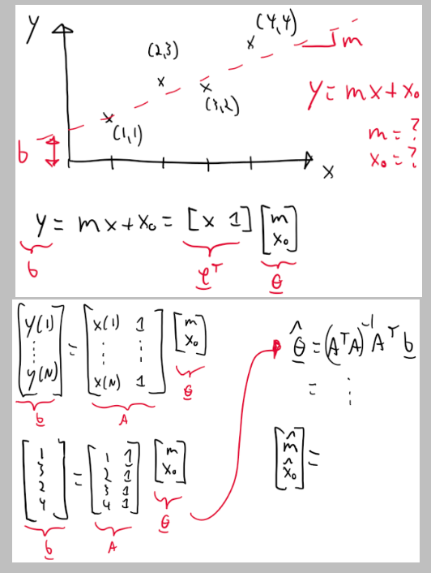

### Rappel sur les bases vectorielles
Rappel sur les bases [ici](../../../Collégial/3e%20session/Algèbre%20linéaire/Vecteurs%20du%20plan.md#Principe%20de%20base). Dans ce cours, on utilisera les lettres $a,b,c$ pour identifier les bases ainsi que des indices $1,2,3$ pour spécifier les trois axes.

Il est possible d'exprimer un vecteur dans une base en faisant le produit scalaire avec chacun des vecteurs unitaires de la base:
$$r_i^a=\vec{r}\cdot\hat{a}_i\rightarrow\underline{r}^a=\begin{bmatrix}\vec{r}\cdot\hat{a}_1\\ \vec{r}\cdot\hat{a}_2\\ \vec{r}\cdot \hat{a}_3\end{bmatrix}$$
### Transfert d'une équation vectorielle vers un équation matricielle
**Lorsque les vecteurs-colonnes sont tous exprimés dans la même base**, on peut transformer les équations vectorielles avec des vecteurs de position en équations matricielles avec des vecteur-colonnes.
### Calcul de longueur, projections et angles avec les composantes
$$\lVert\vec{r}\rVert^2=\vec{r}\cdot\vec{r}=\underline{r}^T\underline{r}=r_1^2+r_2^2+r_3^2$$
$$\lVert\vec{r}\rVert=\sqrt{\underline{r}^T\underline{r}}$$
$$d=\vec{r}\cdot\hat{n}=\underline{r}^T\underline{n}$$
$$\cos{\angle(\hat{n}_1\hat{n}_2)}=\hat{n}_1\cdot\hat{n}=\hat{\underline{n}}_1^T\hat{\underline{n}}_2$$
### Produit vectoriel
$$\vec{u}=\vec{v}\times\vec{w}\rightarrow\underline{u}=\underline{v}^\times\underline{w}\rightarrow\begin{bmatrix}u_1\\ u_2 \\ u_3\end{bmatrix}=\begin{bmatrix}o&-v_3&v_2 \\ v_3 &0&-v_1\\ -v_2&v_1&0\end{bmatrix}\begin{bmatrix}w_1\\ w_2 \\ w_3\end{bmatrix}$$
L'ordre des multiplication est importante
### Produit tensoriel / produit extérieur
$$\vec{v}\vec{w}\rightarrow T=\underline{u}\underline{w}^T=\begin{bmatrix}v_1\\ v_2 \\ v_3\end{bmatrix}\begin{bmatrix}w_1& w_2 & w_3\end{bmatrix}=\begin{bmatrix}v_1w_1&v_1w_2&v_1w_3\\ v_2w_1&v_2w_2&v_2w_3 \\ v_3w_1&v_3w_2&v_3w_3\end{bmatrix}$$
### Espaces fondamentaux
#### Espace colonne
Ensemble des valeurs possibles de la sortie du calcul matriciel
#### Espace nul gauche
Ensemble des valeurs impossibles de la sortie du calcul matriciel

La présence d'espace nul gauche indique un système sous contraint
#### Espace nul
L'ensemble de tous les vecteurs colonnes dont la multiplication avec la matrice donne un vecteur-colonne nul

La présence d'espace nul indique un système sous-contraint
#### Espace rangée
Toutes les combinaisons possibles d'entrées qui peuvent influencé la sortie du calcul.
### Rang d'une matrice
[Voir ici pour base](../../../Collégial/3e%20session/Algèbre%20linéaire/Résolution%20de%20systèmes%20d'équations%20linéaires.md#Caractérisation%20d'un%20système)

Il correspond au nombre de pivot de la matrice. Il est toujours inférieur ou égal aux dimensions de la matrice.
### Quatre situations possible pour un système d'équation
#### Parfaitement contrainte
$r=m=n$: Il n'y a pas d'espace nul ni d'espace nul gauche
#### Trop de variables
$r\lt n$: Il y a un espace nul de dimension $n-r$.

Système sous contraint
#### Trop d'équations
Système sur contraint

$r\lt m$: Il y a un espace nul gauche de dimension $m-r$
#### Trop d'équations et trop de variables
Combinaison des deux autres.

$r\lt m$ et $r\lt n$.
### Méthode des moindres carrés
Lorsqu'un système est sur-contraint, on fait une approximation de la solution avec la méthode des moindres carrés.

La méthode se base sur la formule suivante:
$$\hat{\underline{x}}^* =\mathrm{argmin}\lVert A\hat{\underline{x}}-\underline{y}\rVert^2$$
Pour trouver l'approximation on utilise l'équation suivante:
$$\hat{\underline{x}}=A^+\underline{y}$$
Où l'inverse gauche de Moore-Penrose est notée
$$A^+=\left[A^TA\right]^{-1}A^T$$

Aussi:
$$A^+A=I$$
On peut utilisé la méthode des moindres carrées pour faire une régression linéaire!

### Matrice pseudo-inverse
Lorsqu'un système est sous contraint, il est possible de calculer un matrice pseudo inverse pour obtenir une solution qui optimise une fonction coût quadratique. 

$$\underline{x}^*=Q^{-1}A^T(AQ^{-1}A^T)^{-1}\underline{y}$$
Où $Q$ est la matrice de poids, elle contient les choses qu'on cherche à minimiser. Dans un cas simplifié où $Q=I$:
$$\underline{x}^*=A^\#\underline{y}$$
L'inverse droit de Moore-Penrose est notée:
$$A^\#=A^T(AA^T)^{-1}$$
Aussi:
$$AA^\#=I$$

### Vecteurs et valeurs propres
Voir [ici](../../../Connaissance%20autre/Eigenvalue%20and%20vectors.md) pour les détails.