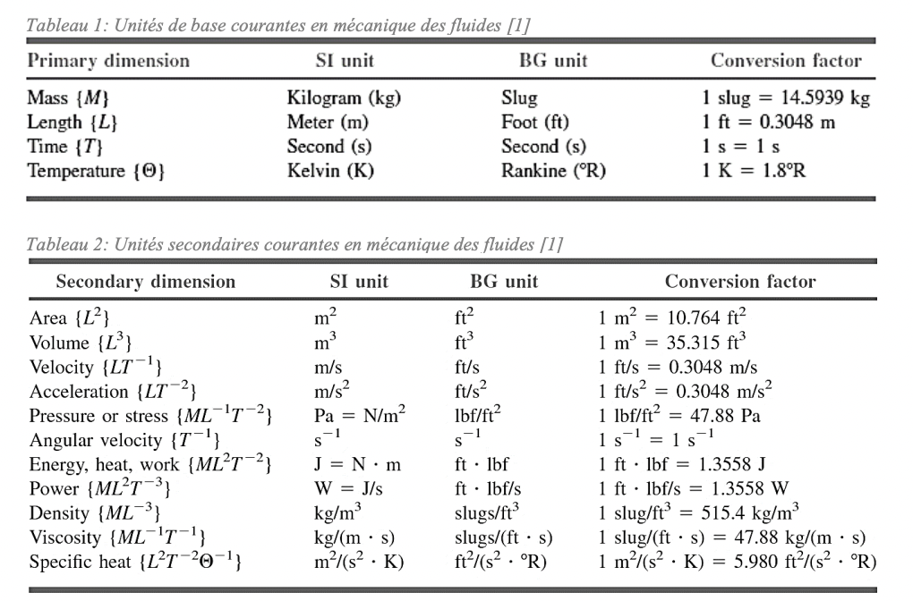

### Définition d'un fluide
Un fluide est une substance qui se déforme continuellement sous l'action d'une contrainte de cisaillement. 

Ainsi, à l'opposé d'un solide, le fluide n'atteint pas un équilibre en présence de forces de cisaillement. 

La force de cisaillement tangentielle au plan est la suivante:
$$\tau=\frac{F}{A}$$ en $N/m^2$. 
### Comparaison avec la pression
Il est intéressant de noter que le cisaillement possède les même unités que la pression. Elle se différencie seulement par la direction qu'elle est appliquée, soit perpendiculairement à une surface. Cependant, le cisaillement est un force donc elle possède une orientation. La pression quant à elle est un scalaire.

### Phases des fluides
#### Liquide
- Surface libre
- Molécules ordonnées
- Volume fini
#### Gaz
- Pas de surface libre
- Molécules désordonnées
- Prend tout l'espace disponible
#### Plasma
- Pas de surface libre
- Molécule désordonnées
- Prend tout l'Espace disponible
- Noyaux et électrons dissociés
- Réactifs aux champs

### Unités

### Propriétés d'un fluide
#### Cisaillement et viscosité
La viscosité est la capacité d'un fluide à résister à une contrainte de cisaillement.
$$\tau=\mu\frac{d\theta}{dt}$$
Où 
- $\tau$ est le cisaillement
- $\mu$ est la viscosité ($kg/m\cdot s)$
- 
Plus le fluide est visqueux, moins il se déformera pour une même contrainte.

Il est souvent plus simple de décrire la viscosité en fonction du gradient de vitesse dans le fluide:
$$\tau=\mu\frac{dV}{dy}$$
Où
- $V$ est la vitesse en $x$ dans le fluide
##### Fluide Newtonien
En ingénierie, une grande partie des fluides ont une viscosité qui ne dépend pas du taux auquel on le déforme, c'est à dire que $\mu$ est une constante. On appelle ces fluides des *fluides Newtoniens*.

#### Pression et densité
La pression se définit comme la force par unité de surface qu'exerce un fluide sur une surface. Il est fréquent d'exprimer la pression en fonction de la pression atmosphérique. 