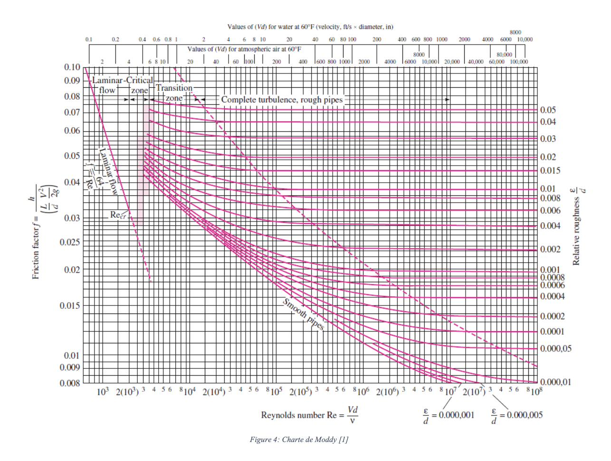
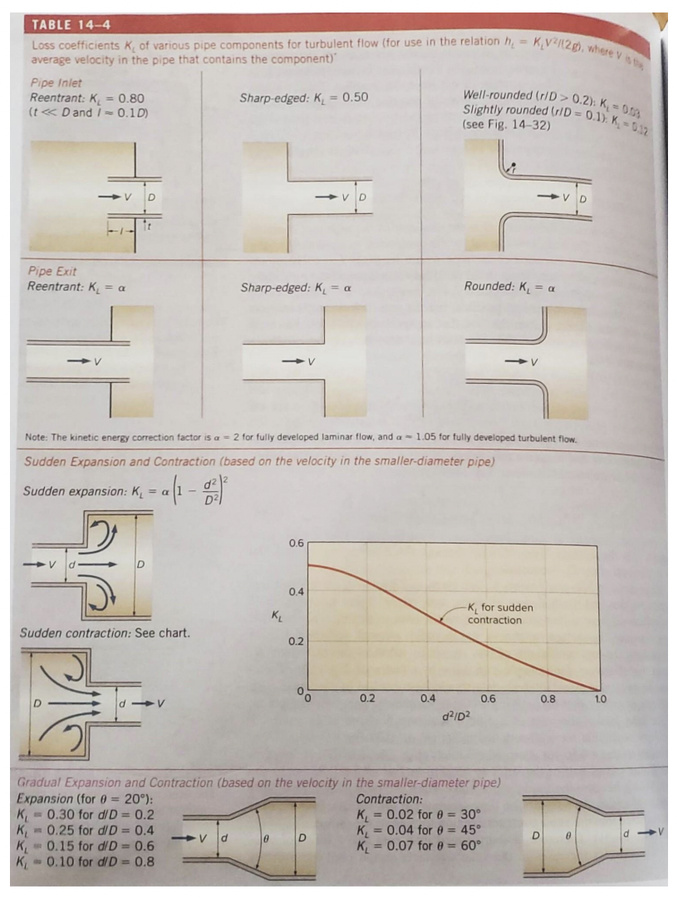
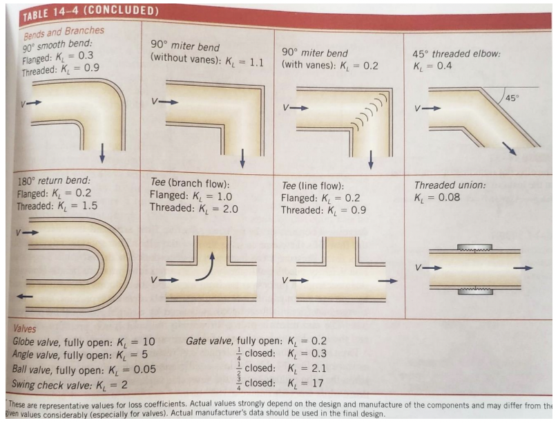

### Volume de contrôle
Un volume de contrôle est l'équivalent d'un système en mécanique classique. Il s'agit d'une partie d'un tout à laquelle on s'Attarde et on étudie les relations.

### Conservation de la masse
La loi de la conservation de la masse stipule que la masse entrant dans un volume de contrôle doit être la même qui sort. En d'autre mot, le débit massique de fluide entrant et sortant est le même. 
$$\dot{m}_{in}=\dot{m}_{out}$$
$$\dot{m}=\rho VA$$
On peut simplifier en disant que $$Q=VA$$Où $Q$ est le débit volumique.

### Conservation de l'énergie

#### Équations sans frottement
Pour des fluides, les mêmes principes d'énergie cinétique et potentielle s'applique qu'en mécanique classique. Il est cependant plus simple de parler d'énergie par unité de masse donc $$e_p=gz$$
$$e_k=\frac{1}{2}V^2$$
$$e_w=\frac{P}{\rho}$$
Pour un écoulement ne subissant pas de travail externe, l'énergie par unité de masse est donnée par $$\frac{P}{\rho} +\frac{1}{2}V^2+gz=\textrm{cst}$$
Le débit d'énergie est donné par $$\dot{E}_{\textrm{flow}}=\dot{m}\left[\frac{P_1}{\rho} +\frac{1}{2}V_1^2+gz_1\right]$$
#### Équations de Bernoulli
En se fiant au principe de conservation de l'énergie et de la masse, on obtient l'équation suivante qui permet de calculer la vitesse et la pression d'un écoulement en tout point: $$\frac{P_1}{\rho} +\frac{1}{2}V_1^2+gz_1=\frac{P_2}{\rho} +\frac{1}{2}V_2^2+gz_2$$
Cette équation est valide seulement lorsque:
- La densité est constante
- Aucun transfert de chaleur ou travail externe
- Système en régime permanent
- Aucune perte visqueuse
- L'écoulement est uniforme

#### Écoulement dans une conduite avec viscosité
Dans la vrai vie, il y a des pertes d'énergie en raison des viscosité sur les parois des conduites. En ajoutant ces pertes, l'équation devient $$\dot{E}_{in}=\dot{E}_{out}+\dot{W}_{visc}$$
On peut aussi séparer les *pertes par friction* et les *pertes par garnitures*: $$\dot{m}\left[\frac{P_1}{\rho} +\frac{1}{2}V_1^2+gz_1\right]=\dot{m}\left[\frac{P_2}{\rho} +\frac{1}{2}V_2^2+gz_2\right]+\dot{W}_f +\dot{W}_g$$
On peut diviser par le débit massique et obtenir $$\left[\frac{P_1}{\rho} +\frac{1}{2}V_1^2+gz_1\right]=\left[\frac{P_2}{\rho} +\frac{1}{2}V_2^2+gz_2\right]+\dot{w}_f +\dot{w}_g$$
Toutefois, il est courant d'exprimer les pertes comme s'il s'agissait de colonnes d'eau hydrostatiques. Il faut donc diviser l'équation précédente par $g$: $$\left[\frac{P_1}{\rho g} +\frac{1}{2g}V_1^2+z_1\right]=\left[\frac{P_2}{\rho g} +\frac{1}{2g}V_2^2+z_2\right]+\dot{h}_f +\dot{h}_g$$
Il ne reste donc plus qu'à exprimer les pertes par friction et garniture $h_f$ et $h_g$ selon les paramètres de l'écoulement.

##### Pertes par friction (ou linéaires)
On peut exprimé les pertes par friction avec l'équation suivante: $$h_f=\frac{V^2}{2g}f\frac{L}{d}$$
Où
- $V$ est la vitesse moyenne d'écoulement
- $L$ la longueur du conduit
- $d$ le diamètre du conduit
- $f$ le coefficient de perte de charge
Ce coefficient dépend de deux nombres sans dimensions dont le *nombre de Reynolds (Re)* mais il est plus souvent obtenu avec un charte de Moddy: 

**Le nombre de Reynolds** pour sa part est un indice du niveau de turbulence dans l'écoulement. On considère qu'au dessus de 2300, il s'agit d'un écoulement turbulent et en dessus d'un écoulement laminaire.
$$\textrm{Re}=\frac{\rho Vd}{\mu}$$
##### Pertes par garniture (pertes mineures)

On représente ces pertes en fonction d'un facteur $K$ qui dépend de la composante: $$h_g=\frac{V^2}{2g}K$$
Encore une fois, c'est proportionnelle à la vitesse moyenne au carré dans la composante.

Si on remplace les deux pertes dans l'équation originale, on obtient: $$\left[\frac{P_1}{\rho g} +\frac{1}{2g}V_1^2+z_1\right]=\left[\frac{P_2}{\rho g} +\frac{1}{2g}V_2^2+z_2\right]+\frac{V^2}{2g}\left[ \sum{f\frac{L}{D}}+\sum{K}\right]$$
### Conservation de la quantité de mouvement (bonus)

La loi de la conservation de la quantité de mouvement s'applique aussi aux fluides.
$$\sum{\vec{F}_{ext}}=\dot{m}\vec{V}_{out}-\dot{m}\vec{V}_{in}$$

### Annexes

