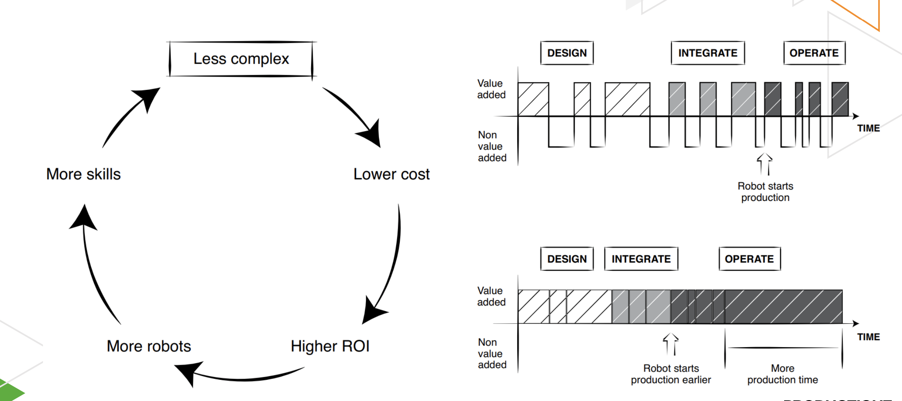
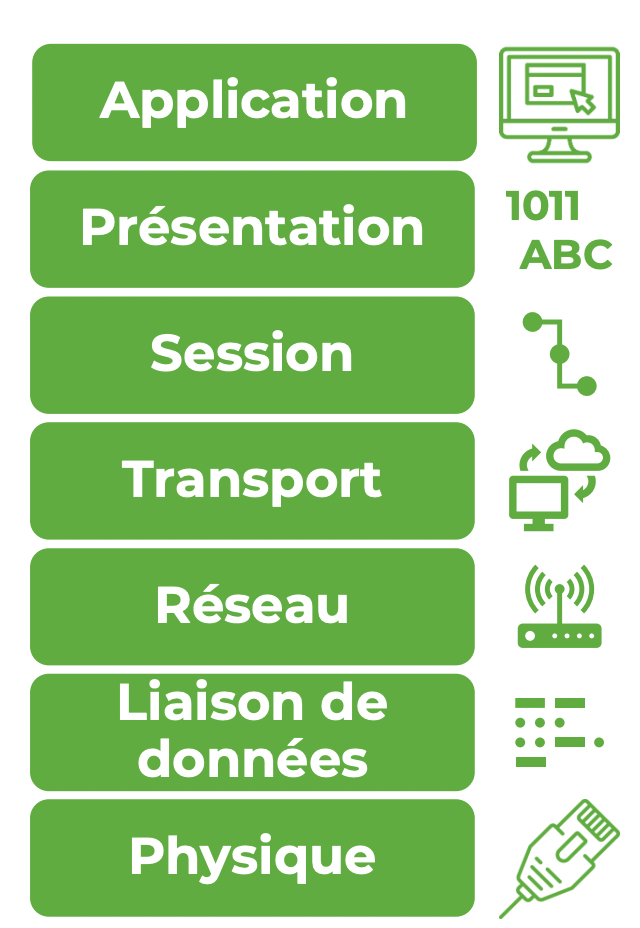

Méthodologie [LEAN](Démarche%20LEAN%20en%20robotique.md)

### Gabarit mécanique
Un gabarit est un outil statique dont la position est connue par le robot et qui facilite le positionnement.

### Capteurs et vision numérique
- Capteur de proximité
- Capteur de fin de course
- Profilomètre (3D)
- Capteur de force

Utilité
- Déclenchement à intervalles
- Déclenchement par encodeur 
- Déterminer la prochaine action
- Déterminer la position de l'outil

### Communication industrielle
La communication industrielle est l’échange d’information entre les systèmes numériques d’une entreprise.

La communication par signaux numériques la plus simple consiste à transmettre des signaux booléens à l’aide de deux niveaux de tension. Généralement à 12V ou 24V en industriel

Utilisez les messages entre l’automate et le robot ou une caméra pour synchroniser les tâches à réaliser.

**La gestion des câbles sur votre robot est importante, autrement le robot va s’entortiller et possiblement briser le câble ou un connecteur. Prévoyez un peu de lousse!**

#### Les protocoles réseaux
Un protocole établit les règles de communication afin que les systèmes qui transmettent et reçoivent l’information puisse bien l’interpréter.

Une pile de protocoles est constituée de différents protocoles qui gèrent chaque étape de la communication.

Le modèle TCP/IP est plus utilisé que le modèle OSI. Il comprend les mêmes couches à l’exception des couches session et présentation en moins.

Ethernet/IP est un protocole industriel qui définit les couches de la pile de protocoles. C’est la couche application qui le distingue d’autres protocoles industriels dont Modbus TCP.

Ethernet/IP utilise le **Common Industrial Protocol** sur sa couche application

**Communication implicite**: Échange d’information entre un équipement qui publie de l’information et un équipement qui souscrit à cette information. 

**Communication explicite**: Échange d’information sous la forme d’une requête précise transmise par un équipement vers un autre.

Le **CIP** gère l’information à l’aide de structures de données appelées objets.

Une classe définit les attributs d’un type d’objets. Chaque objet est une instance d’une classe.

Un fichier **EDS** pour *Electronic Data Sheet* regroupe les paramètres de connexion d’un équipement utilisant le protocole EtherNet/IP. Il est parfois fourni par le fournisseur sur son site internet et peut ensuite être chargé dans un logiciel comme Studio 5000 pour faciliter la configuration de la connexion entre cet équipement et l’automate.