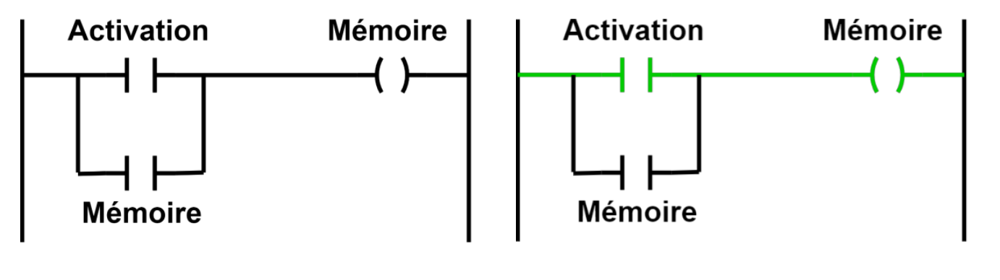
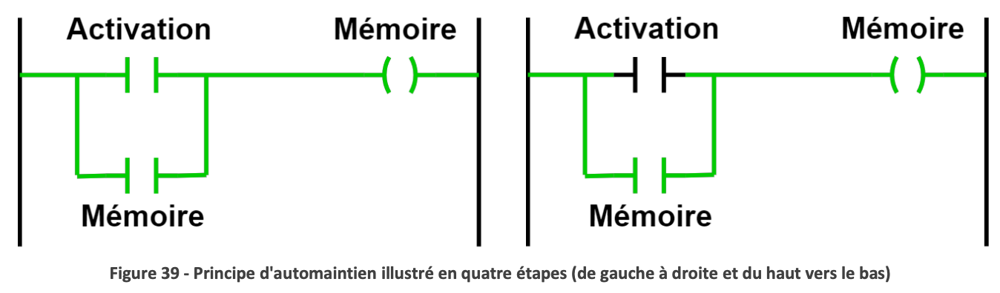
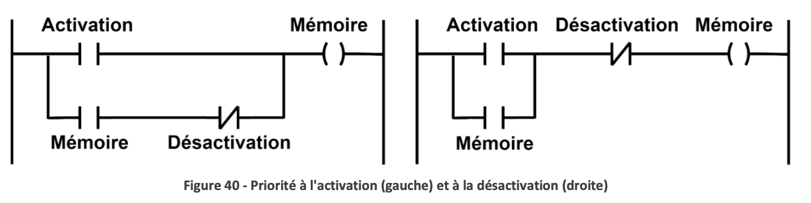

Signaux: représente de l'information transmise, il peut être [analogique et numérique](../APP1/Systèmes%20numériques.md#Signaux%20analogiques%20et%20numériques).

Système: traite les signaux numériques, il y en a des combinatoires et des séquentiels. Un système [combinatoire](../APP1/Conception%20d'un%20système%20combinatoire.md) utilise seulement l'information actuelle tout s'exécute simultanément. Un système [séquentiel](../APP3/S2APP3.md) utilise aussi de l'information passé et il suit une suite d'étape.

### Qualité d'un bon programme
- Modulaire
- Simple à comprendre
- Simple à maintenir
### Machine à états finis
La machine a un nombre fini d'état, on fait une transition entre les différent états et on exécute des actions selon notre état. Il n'y a pas de *if...else* imbriqués. On s'intéresse aux machines à états *synchrones*, qui roule à une certaine fréquence.
#### Machine de Moore
La sortie est défini par l'état courant seulement. L'action se déroule dans l'état courant.
#### Machine de Mealy
La sortie est défini par l'état présent et par les signaux numériques. L'action se déroule dans la transition.
#### Principe d'auto-maintien

On garde en mémoire l'état précédent même lorsque la variable d'excitation n'est plus activée. On a une mémoire. On doit aussi ajouter une variable de désactivation de l'état pour pouvoir en sortir. 
On peut donner priorité à la désactivation ou à l'activation.