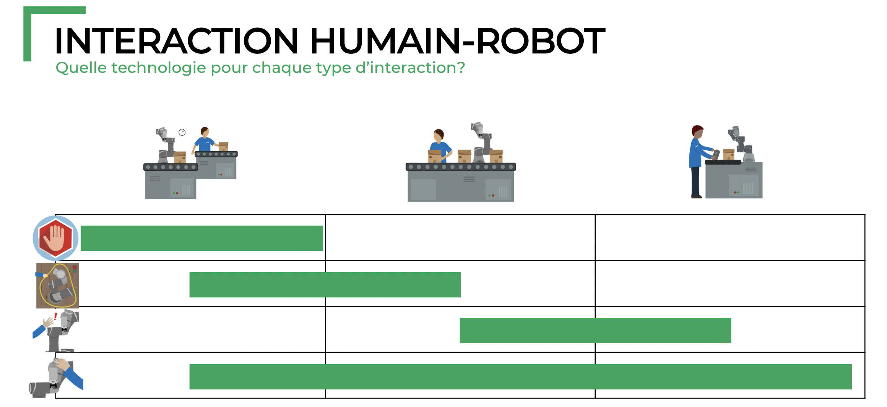

### Caractéristique d'un robot collaboratif
Un robot est *collaboratif* parce qu’il travaille en interaction étroite avec des personnes de façon sécuritaire. Il comporte des technologies comme:
1. Arrêt de sécurité automatique
	1. Détection de la présence humaine par un équipement de sécurité
2. Zone de vitesse réduite
	1. Détection de la présence humaine par un système de vision ou scanneur de zone
3. Force et puissance limitées
	1. Aucun équipement de sécurité requis
	2. Mécanismes limités par la surveillance de force
4. Guidage manuel
	1. Programmation à la main du robot et enregistrement des points
	2. Capteurs de force sur le poignet

Un robot collaboratif à une vitesse et puissance limité, aucun arrête vive et des formes arrondies
### Différence avec collaboratif, coopératif et cohabitation
#### Cohabitation
Le robot et l’ouvrier travaillent à proximité, mais dans des espaces séparés. Leurs tâches peuvent être similaires ou différentes. L’interaction a lieu lorsque le robot est à l’arrêt et qu’il est reprogrammé par l’ouvrier
#### Coopération
Le robot et l’ouvrier travaillent à des étapes différentes d’une même tâche. Le travail de l’un influence donc celui de l’autre. Chacun a son espace de travail séparé, mais bien souvent ceux-ci sont situés près l’un de l’autre.
#### Collaboration
Le robot et l’ouvrier travaillent à la même tâche en étroite proximité. Ils partagent le même espace de travail et coordonnent leurs actions pour être efficaces et éviter des collisions dangereuses.

*L’objectif du robot n’est pas de remplacer l’humain, mais de l’appuyer pour valoriser ses compétences et son savoir-faire.*

### Critère de sélection d'un robot collaboratif
- Charge utile: combien il peut supporter
- Portée du bras
- Justesse et répétabilité
- Coût initiale
- Sécurité autour du robot
- Interface de programmation
- Capteurs et outils disponibles
- Masse du robot

