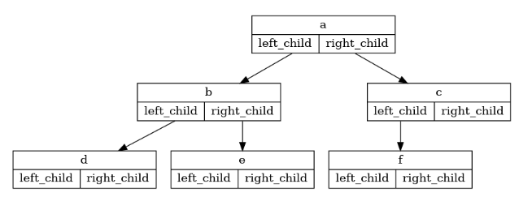
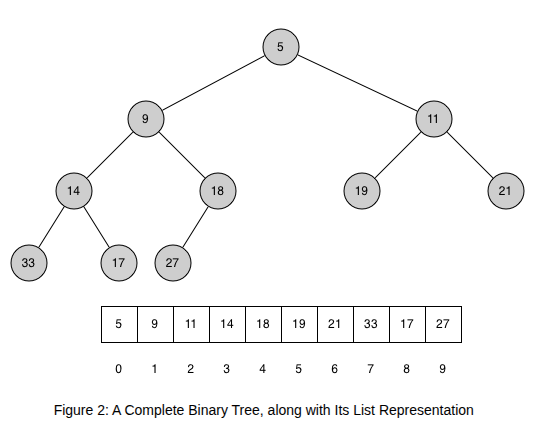

### Définition
Il s'agit d'une structure de donnée qui lorsque représentée graphiquement, ressemble à un arbre à l'envers. 

Un arbre est composé de nœuds et de liens entre ses nœuds. Chaque nœud possède un lien entrant et il peut y avoir plusieurs liens sortant.

### Arbre binaire
Il existe un groupe plus précis d'arbre nommé les arbres binaires. Dans cette catégorie, chaque nœud se connecte exactement à deux autres nœud en sortie. 

Une bonne manière de construire un arbre binaire est de mettre les valeurs plus petites que le nœud à gauche et les valeurs plus grande à droite. Contrairement à l'image ci-dessus.
#### Problème d'un arbre binaire
Si un arbre binaire est mal balancé, il aura de mauvaise performance.

C'est pour ça qu'il est important de balancer les arbres binaires.

#### Arbre AVL
Il existe un type d'arbre qui se balance automatiquement, l'arbre AVL. Pour se faire, il faut créer un variable qui s'appelle le *facteur de balancement*. $$\textrm{balance\_factor}=h\textrm{(left\_subtree)}-h\textrm{(right\_subtree)}$$
Où $h(\textrm{noeud})=\max(h\textrm{(noeud\_gauche)},h\textrm{(noeud\_droit)})+1$ en partant des feuilles

L'arbre AVL est $O(\log{n})$ pour la recherche d'élément.