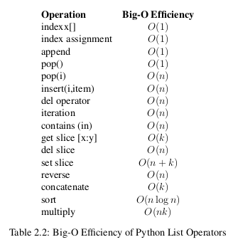
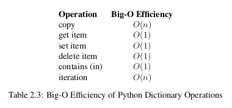

Il s'agit d'une manière de faire l'analyse de différents algorithmes. L'analyse est divisé en deux catégories: la complexité de temps et la complexité de mémoire.

### Complexité de mémoire
Il s'agit d'analysé la quantité de mémoire utilisée par un algorithme et on peut comparer plusieurs algorithmes entre eux. En général, utiliser moins de mémoire est un positif.

### Complexité de temps
La complexité de temps évalue le temps requis pour exécuter un algorithme. Cependant, seulement comparé directement du temps n'est pas efficace car un algorithme peut rouler à une vitesse différente dépendant de l'ordinateur sur lequel il est exécuté. Il faut donc une meilleur façon de juger la vitesse d'un algorithme.

#### La notation Big-O
Au lieu de compter du temps, il s'agit de compter le nombre d'opération nécessaire à l'algorithme. La notation **Big-O** va encore plus loin. Au lieu de compter exactement le nombre d'opération, on évalue l'ordre de l'algorithme. En d'autres mots, comment le nombre de données impact la temps d'exécution. Il s'agit du approximation basé sur le terme ayant le plus d'impact dans l'exécution. Si notre algorithme prend $1 + n$ opération où $n$ est le nombre de données, on dit que le temps d'exécution de l’algorithme augmente de façon linéaire avec le nombre de donnée. On écrit cela $O(n)$. Si par contre l’algorithme était le suivant: $1+2n+3n^2$ on écrirait plutôt $O(n^2)$ car lorsque $n$ est grand, les autres termes ont une influence négligeable sur le total.
##### Exemple de notation Big-O
Voici différente manière qu'un algorithme peut être classifié:
 

### Performance des structures de données Python
#### Liste

#### Dictionnaire
