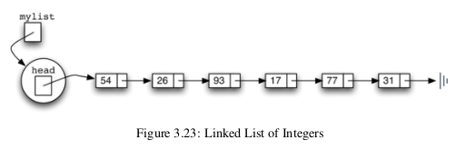

Une liste est une structure de données de base en Python. Elle possède plusieurs opérations qui permettent d’interagir avec elle.

### Liste non-ordonnée
Il s'agit de la liste de base qui possède des items et leur position relative entre eux. Il existe plusieurs méthodes pour interagir avec ces listes:
```python
List() # Crée une liste vide
add(item) # Ajoute un item àu début de la liste
remove(item) # Retire un item de la liste
search(item) # Retourne si un item est présent dans la liste
is_empty() # Retourne si la liste est vide
size() # Retourne la taille de la liste
append(item) # Ajoute un item à la fin de la liste
index(item) # Retourne la position d'un item dans la liste
insert(position,item) # Insère un item à la position voulue dans la liste
pop() # Retire et retourne le dernier élément de la lsite
pop(position) # Retire et retouren l'item à la position voulue de la liste
```
#### Implémentation
Pour créer une liste non-ordonnée, on peut utiliser le concept d'une liste chaînée. Une liste chaînée est un ensemble d'item qui contiennent tous: une donnée, un lien vers la prochain item. On appelle ces items des *nœuds*.
