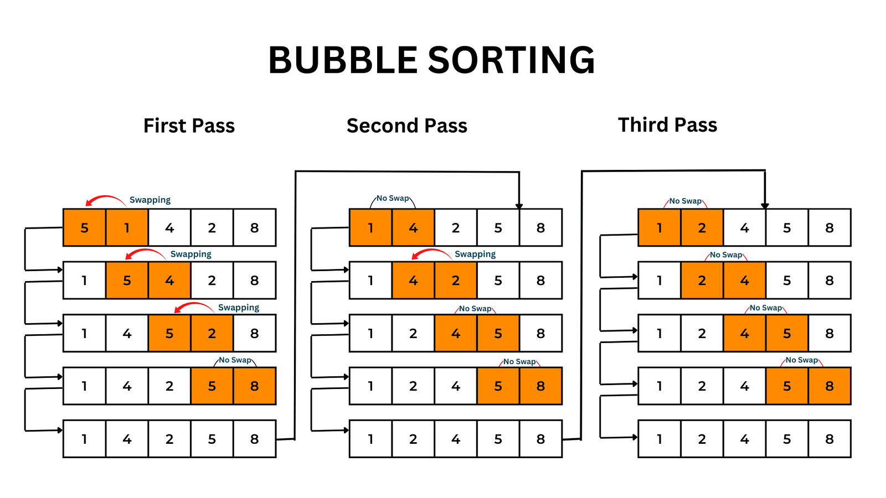
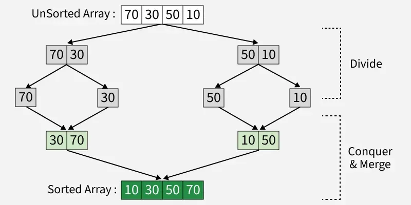

Il existe différents algorithmes de tri qui ont chacun leur avantage et désavantage. Voici une liste des plus commun:
### Bubble sort
Il s'agit d'un algorithme de tri qui prend plusieurs passes pour trier une liste. Il s'agit de comparer deux éléments, les inverser s'ils ne sont pas dans le bonne ordre et de passer au prochain et répéter. Comme il faut potentiellement passer $n$ fois dans une liste de $n$ élément, cette algorithme est classifié $O(n^2)$.

### Selection sort
Similaire à bubble sort mais il fait seulement un échange par passe, il trouve la plus grand valeur et l'envoie à la fin. Par contre, il s'agit encore d'un algorithme $O(n^2)$. 
### Insertion sort
Très similaire à selection sort mais il ajoute les items trier au début de la liste. Il est quand même $O(n^2)$. 

### Merge sort
L'algorithme de merge sort divise récursivement une liste en deux jusqu'à ce qu'elle ne peuvent plus être diviser. Ensuite elle recombine les sous-listes ensemble en ajoutant l'élément le plus petit un à la fois. Elle recombine de façon récursive jusqu'à se que la liste soit triée. Cet algorithme est très efficace et est $O(n\log{n})$.

### Quick sort
Cet algorithme utilise un pivot pour séparer un liste et la re-trier de manière récursive un peu comme merge sort. Lorsque le pivot est choisi, on déplace un marqueur à droit et à gauche. Dès qu'on item plus grand que le pivot à gauche est trouvé ainsi qu'un item plus petit que le pivot à droite, on les inverse et on répète jusqu'à ce que les deux marqueurs se croise. On sépare donc la liste à cet endroit et on rapplique quick sort sur les deux listes restantes. Cette algorithme dépend du choix de pivot. De manière optimale, il est $O(n\log{n})$. 

Pour bien choisir un pivot, il existe un technique, on prend le premier, le dernier ainsi que l'item du milieu et on choisi le médian de ces trois items en tant que pivot.
