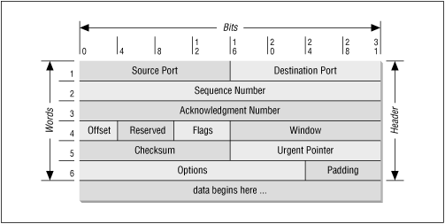

Transmission control protocol

### Modèle de service TCP
Pour communiquer en TCP il faut créer un *socket* du côté expéditeur et un autre du côté receveur.

Chaque socket possède un numéro constitué de l'adresse IP et d'un nombre de 16 bits appelé **port**. Les ports inférieur à 1024 sont appelé des ports réservés. Une connection TCP est bidirectionnelle et de point à point. TCP ne permet pas le broadcasting ou le multicasting. Les paquets TCP peuvent avoir un drapeau *PUSH* pour forcer leur envoie immédiat si le délai de temporisation des paquets est nuisible.

### Protocole TCP
Les appareils échangent des données sous forme de segments TCP. C'est segments sont formés d'un en-tête de 20 octets (plus une partie optionnelle) suivi de 0 ou plusieurs octet de données. La première limite de longueur d'un segment est qu'il doit tenir dans la taille de 65535 octets de la charge utile IP. La seconde est que chaque liaison possède une **unité de transfert d'information maximale (MTU ou maximum transfer unit)**. En pratique le MTU fait généralement 1500 octets (la taille de la charge utile Ethernet). Quand un récepteur reçoit un segment, il envoie un accusé de réception à l'expéditeur. Celui renvoie le segment s'il ne reçoit pas l'accusé dans un certain délai. Les segments TCP peuvent être transmis ou reçus dans le désordre alors TCP doit pouvoir gérer ces cas limites.

### En-tête de segment TCP

Au début, il y a le port de la source et le port de la destination. Ensuite il y a les numéro de séquence et de réception. Le numéro de réception indique le prochain octet dans l'ordre attendu et non le dernier reçu.

La longueur de l'en-tête aussi appelé offset indique combine de mots de 32 bits sont contenu dans l'en-tête TCP. Il indique donc le point de départ des données. Il y a ensuite 4 bits réservés.

Il y a ensuite 8 drapeaux: ECE sert à signaler la congestion réseaux. CWR sert à signaler une réduction de la congestion. URG est pour signaler un pointeur d'urgence. ACK est l'accusé de réception. PSH est le drapeau de données poussées. RST sert à réinitialisé la communication TCP. SYN sert à établir la connection TCP et est indirectement relié au ACK. FIN signale la fin d'une communication.

La taille de la fenêtre indique combien d'octets on peut transmettre après le dernier octet acquitté. Le champs somme de contrôle permet de valider la fiabilité de la réception du message.

Le champ option permet d'ajouter des données supplémentaire non considérées par l'en-tête.

### Établissement d'une connexion TCP
Un serveur commence en étant en attente d'une requête. Un client envoie une primitive connect qui indique l'adresse IP, le port auquel il veut se connecter, la taille maximale de segment et des données utilisateurs. La primitive connect envoie un segment TCP avec SYN à 1 et ACK à 0. Le serveur valide si le port voulu existe sinon il envoie un segment avec RST à 1. Si le port existe, il envoie un accusé de réception et la communication commence.
### Libération de la connexion TCP
La communication est terminé de manière indépendante pour l'enmvoyeur et le receveur. Le receveur peut envoyer un FIN à 1 pour dire qu'il n'a plus de données à transmettre. L'envoyeur peut quand même continuer de transmettre des données tant qu'il n'a pas lui même envoyé sont FIN à 1.
### Gestion de la communication TCP

On peut représenter la communication TCP par cette machine à état.